<!-- @import "[TOC]" {cmd="toc" depthFrom=1 depthTo=6 orderedList=false} -->
<h2 align = "center" >Aula 09  - Arquitetura - 27/09/2022<h2>

<h3 align = "center" ><a href="https://github.com/ffborelli/curso-brq-java-2022-09-05">Professor: Fabrizio Borelli</a></h3>
</br></br>

# Objetivo da Aula

A importancia de entender o que é classe e objeto com o professor Nelson - Esse conceito é muito importante para o seguimento do conhecimento.

Inicio sobre como fazer micro-serviços
Introdução ao Intellij
Introdução ao Postman

Descrição da arquitetura de Software

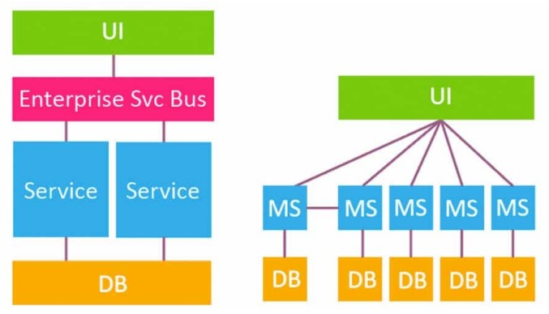

# API Rest (Representational State Transfer)
Significa Transferência Representacional de Estado é um modelo de arquitetura e não uma linguagem ou tecnologia de programação, que fornece diretrizes para que os sistemas distribuídos se comuniquem diretamente usando os princípios e protocolos existentes da Web sem a necessidade de **SOAP** ou outro protocolo sofisticado.
O princípio fundamental é usar o protocolo HTTP para comunicação de dados.

A arquitetura **REST** é simples e fornece acesso aos recursos para que o cliente REST acesse e renderize os recursos no lado do cliente. No estilo REST, URI ou IDs globais ajudam a identificar cada recurso.

Esta arquitetura usa várias representações de recursos para representar seu tipo, como XML, JSON, Texto, Imagens e assim por diante.

Vale ressaltar que o REST não se limita a solicitações e respostas de registros. Também é possível inserir um novo registro ou deletar um já existente.

# Responsabilidades no REST
Existe no REST um princípio chamado STATELESSNESS (sem estado), onde o servidor não precisa saber em qual estado o cliente está e vice-versa. Mas o que é um servidor e um cliente?

**Cliente**: é o componente solicitante de um serviço e envia solicitações para vários tipos de serviços ao servidor.

**Servidor**: É o componente que é o provedor de serviços e fornece continuamente serviços ao cliente conforme as solicitações

Nesta arquitetura ou modelo, cliente-servidor ajuda na separação de responsabilidades entre a interface do usuário e o armazenamento de dados. Ou seja, quando uma solicitação REST é realizada, o servidor envia uma representação dos estados que foram requeridos.

Não há limite superior no número de clientes que podem ser atendidos por um único servidor. Também não é obrigatório que o cliente e o servidor residam em sistemas separados.

A comunicação entre cliente e servidor ocorre através da troca de mensagens usando um padrão de solicitação-resposta. O cliente basicamente envia uma solicitação de serviço e o servidor retorna uma resposta.

[API Google Maps](https://developers.google.com/maps/documentation?hl=pt-br)

# Requisições e comunicações
O REST precisa que um cliente faça uma requisição para o servidor para enviar ou modificar dados. Um requisição consiste em:

- Um verbo ou método **HTTP**, que define que tipo de operação o servidor vai realizar;
- Um header, com o cabeçalho da requisição que passa informações sobre a requisição;
- Um path (caminho ou rota) para o servidor, informação no corpo da requisição, sendo esta informação opcional.
- Métodos HTTP

Em aplicação REST, os métodos mais utilizados são:

- O método **GET** é o método mais comum, geralmente é usado para solicitar que um servidor envie um recurso;
- O método **POST** foi projetado para enviar dados de entrada para o servidor. Na prática, é frequentemente usado para suportar formulários HTML;
- O método **PUT** edita e atualiza documentos em um servidor;
- O método **DELETE** que como o próprio nome já diz, deleta certo dado ou coleção do servidor.
[Lista completa dos métodos](https://developer.mozilla.org/pt-BR/docs/Web/HTTP/Methods)

# Códigos de Respostas
Cada resposta que a aplicação REST retorna, é enviado um código definindo o status da requisição. Por exemplo:

- 200 (OK), requisição atendida com sucesso;
- 201 (CREATED), objeto ou recurso criado com sucesso;
- 204 (NO CONTENT), objeto ou recurso deletado com sucesso;
- 400 (BAD REQUEST), ocorreu algum erro na requisição (podem existir inumeras causas);
- 404 (NOT FOUND), rota ou coleção não encontrada;
- 500 (INTERNAL SERVER ERROR), ocorreu algum erro no servidor.
[Lista completa das respostas](https://developer.mozilla.org/pt-BR/docs/Web/HTTP/Status) 
Estes são os principais, porém neste link você encontrará a lista completa do código de cada requisição.

# Postman

### saiba como instalar e dar seus primeiros passos

## Utilizar o Postman nos trará vantagens como:

- Facilidade em criar, compartilhar, testar e documentar APIs.
- Converter JSON (JavaScript Object Notation) em várias linguagens.
- Automatizar e criar rotinas de testes.
- Sincronizar entre diversos aplicativos.
- Armazenar dados para uso em outros testes.
- Não precisa pagar para utilizar, entretanto, há recursos pagos.

Essa é uma ferramenta importante no trabalho do desenvolvedor, auxia a:
- construir
- consumir
- testar
- documentar
- compartilhar APIs. 
- salvar e recuperar as respostas, de forma detalhada, das suas requisições HTTP e HTTPs. 


# Instalação no Windows

Acessar a página de [downloads](https://www.postman.com/downloads/) no site oficial do Postman. O próprio site irá recomendar a versão mais adequada para sua máquina. 
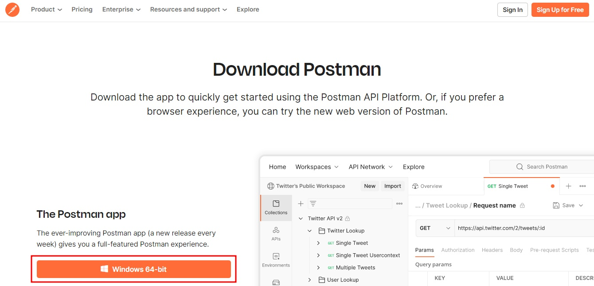
Logo após baixar, acessar a pasta onde foi realizado o  Downloads, teremos um arquivo com um nome semelhante a este: “Postman-win64-Setup”. Clique no arquivo e o programa será instalado automaticamente no seu computador.
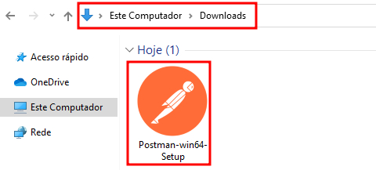
Ao final da instalação, será feito um redirecionamento para uma página de Login do programa. Nesta página serão dadas as opções “Criar conta ou fazer login” (em inglês, “Create an account or sign in”) e logo abaixo da tela terá a opção de “Criar conta ou fazer login depois? Pule e vá para o aplicativo” (em inglês, ”Create your account or sign in later? Skip and go to the app”).
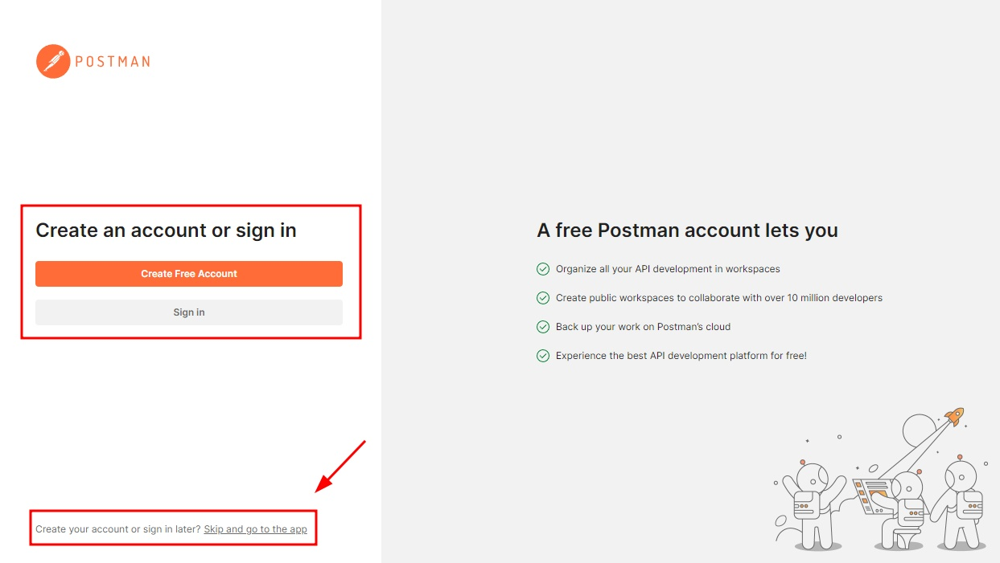
Clique na opção de pular e ir para o aplicativo e você será redirecionado para a página principal do Postman.

Obs: Clicar na opção de pular o login e ir para o aplicativo.
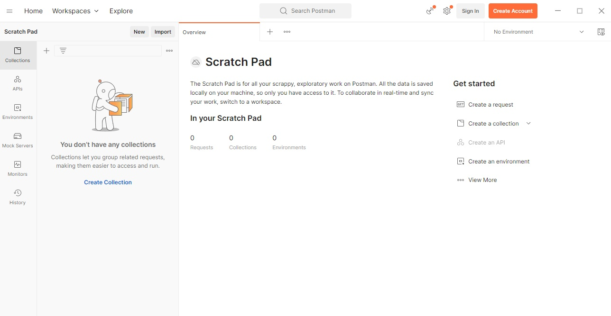

# Primeiros passos com o Postman

Através dos métodos de requisição HTTP. Os principais são: GET e POST.

**GET**: É usado para buscar um recurso específico. Retorna apenas dados.
**POST**: É usado para enviar dados a um determinado recurso.
Vale destacar que para utilizar o Postman é um pré-requisito conhecer HTTP, pois essa ferramenta aborda muitos conceitos relativos ao uso deste protocolo

Vamos supor que você é freelancer e recebeu um trabalho de uma empresa fictícia chamada “Correios Diretos” para verificar o endereço de alguns colaboradores através de uma famosa API que é a [ViaCEP](https://viacep.com.br/). Com essa API é possível verificar o endereço através de uma busca de CEP.

A URL disponibilizada por esta API para consultas de CEP está estruturada da seguinte maneira:
```
viacep.com.br/ws/01001000/json/

```
Onde deve ser informado um CEP no formato de 8 dígitos, como no exemplo: "01001000". Após o CEP, deve ser fornecido o tipo de retorno desejado, para este exemplo utilizamos o formato JSON.

# Vamos abrir o Postman.
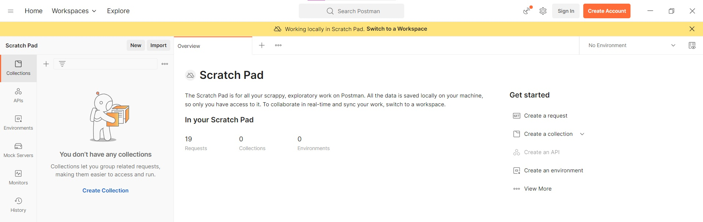
Após abrir o Postman, vamos selecionar a opção “new” (em português, “novo”) e após isso, selecionar a opção “HTTP Request” (em português, Requisição HTTP) destacada na imagem abaixo:
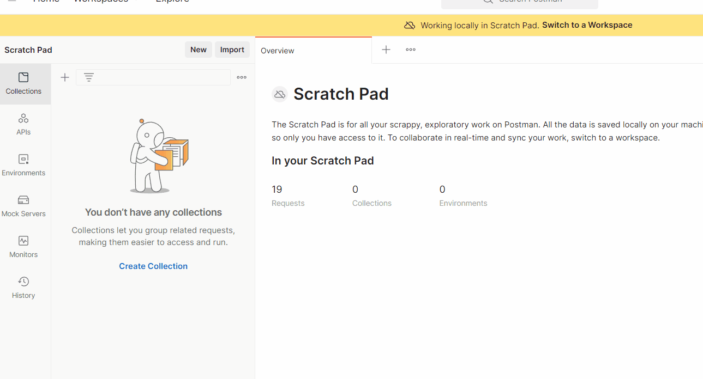
Feito isso, o Postman abrirá tela abaixo, que é onde vamos realizar as requisições.
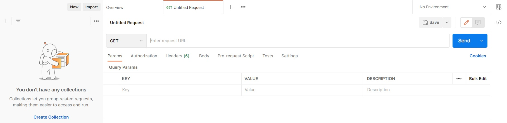
Veja que a opção destacada abaixo lista diversas formas de realizar essa requisição. Como neste exemplo o objetivo é somente verificar e testar a API, iremos utilizar o verbo GET que nos devolverá o conteúdo solicitado através da URL que vimos anteriormente.
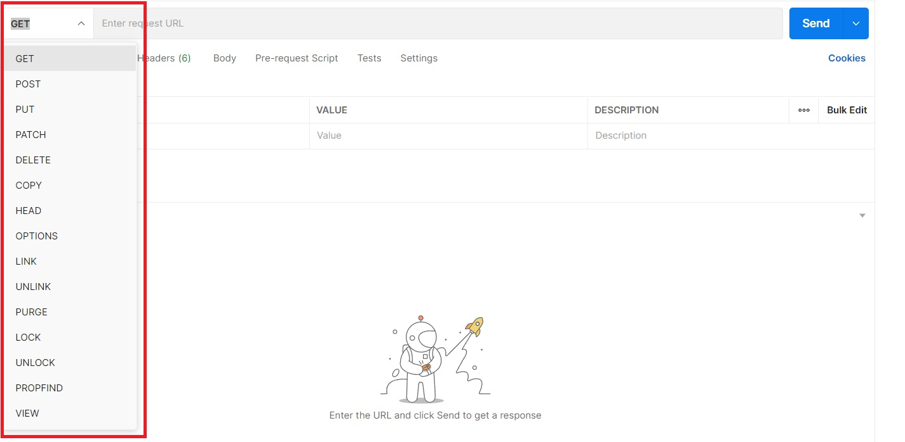
Sabendo que utilizaremos o método GET para recuperar as informações, agora precisamos informar qual CEP utilizar. Para este exemplo, utilizaremos este CEP: 04101300. Dessa forma a URL da API ficará da seguinte maneira:
```
https://viacep.com.br/ws/04101300/json/

```
Com essas informações, agora podemos selecionar o método GET e colar a URL na barra de busca. Após isso, clicamos no botão “send” (em português, “enviar”), conforme a animação abaixo:
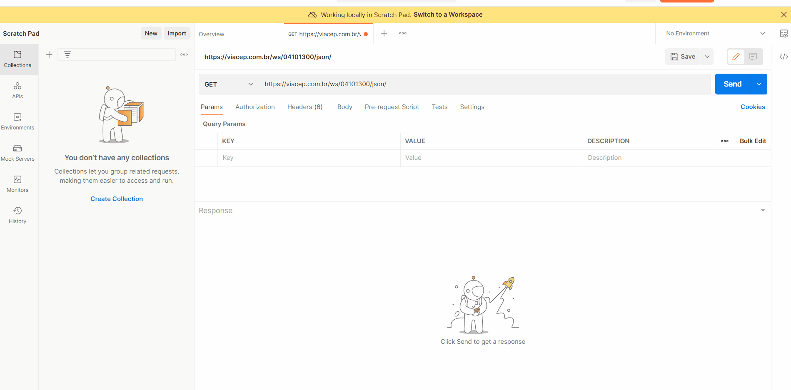
No campo “Body” do Postman foram retornados os dados deste CEP, como: “logradouro”, “complemento”, “bairro” e entre outros. Além disso, o Postman nos informa outros dados importantes que estão destacado na imagem abaixo, como: Status: 200, que significa que obtivemos êxito na requisição; Time: 431ms, que mostra o tempo necessário para realizar esta requisição; Size: 749 B, que indica o tamanho em bytes dos dados desta resposta.
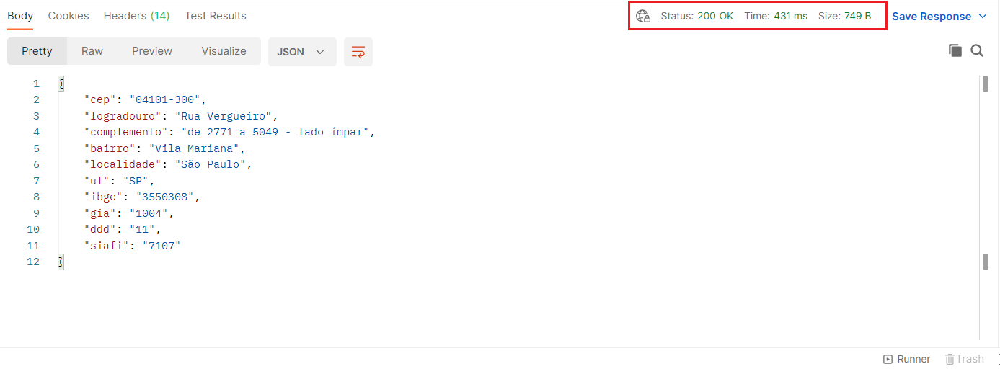

Neste primeiro exemplo obtivemos êxito com nossa busca, mas e se informarmos um CEP inválido?

Agora, vamos usar um CEP inválido com 7 dígitos para verificar o retorno. A URL ficará como abaixo:

```
https://viacep.com.br/ws/7777777/json/

```
Faremos o mesmo processo, mas o resultado obtido para esta requisição será:

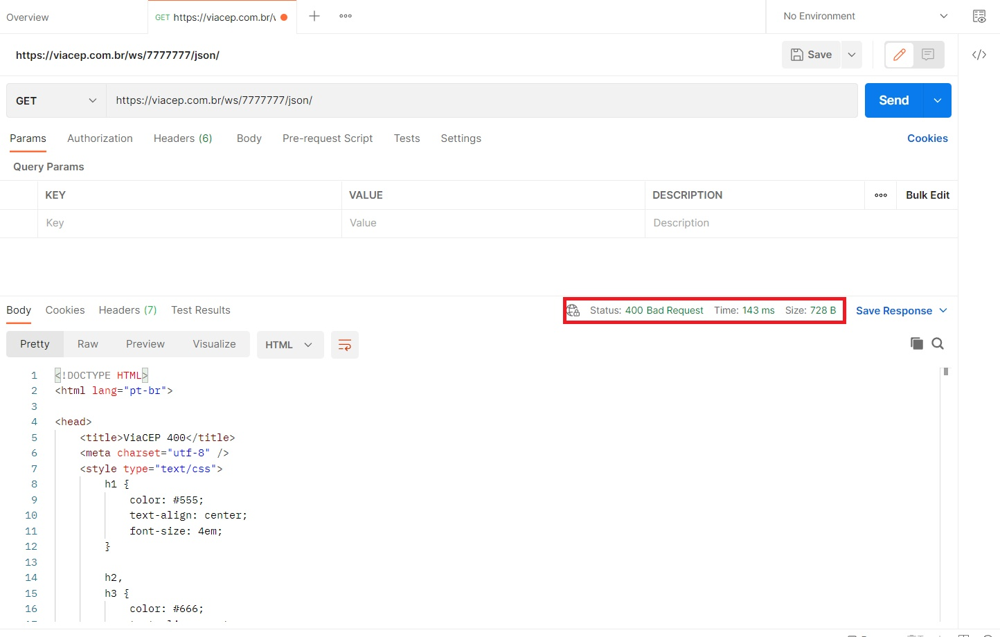

No primeiro momento é possível notar que não recebemos uma resposta em JSON no campo “Body”, e sim um código em HTML, e o status para esta requisição foi **400**, que significa que a resposta não foi encontrada devido algum problema com o endereço. Este resultado era esperado, tendo em vista que não preenchemos os 8 números que essa API esperava receber para procurar as informações do endereço.

[Vídeo do Youtube](https://www.youtube.com/watch?v=op81bMbgZXs)

[Testes de API com Postman](https://cursos.alura.com.br/extra/alura-mais/testes-de-api-com-postman-c883)
