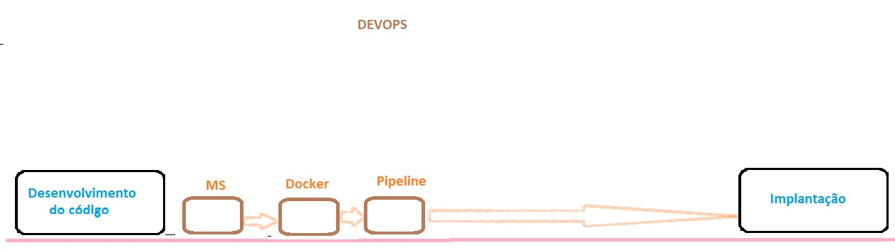

<h2 align = "center" >Aula 10  - Arquitetura - 28/09/2022<h2>

<h3 align = "center" ><a href="https://github.com/ffborelli/curso-brq-java-2022-09-05">Professor: Fabrizio Borelli</a></h3>
</br></br>

# Objetivo da Aula
- API Rest
    - [API Grande Porte](https://cors.grandeporte.com.br/cursos.grandeporte.com.br:8080/professores/)
- Introdução ao Micro-Serviço
- Verbos HTTP: Patch - Put - Delete
- CRUD

# Processo de Desenvolvimento de Código


# Qual é a diferença entre o método PUT e o PATCH?

Em poucas palavras, os métodos HTTP **PUT** e **PATCH** são usados para indicar um _requisição de alteração de dados._

Geralmente, ao usar-se o PUT, fica legível que a alteração do dado será com referência a entidade completa.

Exemplo: (/usuario/1234) :

**Resultado**: ```{'id': 1234, 'name': 'Joao', 'idade': 25, 'documento': '123.321.12-X'}```

O **PATCH** é usado para _atualização parcial_, quando você não quer mandar o payload completo.

Exemplo: (/usuario/1234) :

**Resultado**: ```{'name': 'João'}```

# CRUD -> CREATE, READ, UPDATE , DELETE

É Criar, Ler, Alterar e Deletar uma **ENTIDADE**, como por exemplo, professores.

1. GET ALL (READ)
2. GET ONE (READ)
3. POST    (CREATE)
4. PATCH   (UPDATE) ou PUT (UPDATE)
5. DELETE  (DELETE)

**Sendo mais genérico:**

1. GET ALL --  /entidade
2. GET ONE (READ) --  /entidade/{id_da_entidade}
3. POST    (CREATE) --  /entidade
4. PATCH   (UPDATE) ou PUT (UPDATE) --  /entidade/{id_da_entidade}
5. DELETE  (DELETE) /entidade/{id_da_entidade}

**Exemplo:**

1. GET ALL --  /usuarios
2. GET ONE (READ) --  /usuarios/{id_do_usuario}
3. POST    (CREATE) --  /usuarios
4. PATCH   (UPDATE) ou PUT (UPDATE) --   /usuarios/{id_do_usuario}
5. DELETE  (DELETE)  /usuarios/{id_do_usuario}
6. GET /usuarios/{id_do_usuario}/nome/{nome_do_usuario}

