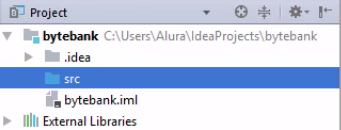

<h2 align = "center" >Aula 10  - Arquitetura - 28/09/2022<h2>

<h3 align = "center" ><a href="https://github.com/ffborelli/curso-brq-java-2022-09-05">Professor: Fabrizio Borelli</a></h3>
</br></br>

# Objetivo da Aula
- API Rest
    - [API Grande Porte](https://cors.grandeporte.com.br/cursos.grandeporte.com.br:8080/professores/)
- Introdução ao Micro-Serviço
- Verbos HTTP: Patch - Put - Delete
- CRUD

# Processo de Desenvolvimento de Código


# Qual é a diferença entre o método PUT e o PATCH?

Em poucas palavras, os métodos HTTP **PUT** e **PATCH** são usados para indicar um _requisição de alteração de dados._

Geralmente, ao usar-se o PUT, fica legível que a alteração do dado será com referência a entidade completa.

Exemplo: (/usuario/1234) :

**Resultado**: ```{'id': 1234, 'name': 'Joao', 'idade': 25, 'documento': '123.321.12-X'}```

O **PATCH** é usado para _atualização parcial_, quando você não quer mandar o payload completo.

Exemplo: (/usuario/1234) :

**Resultado**: ```{'name': 'João'}```

# CRUD -> CREATE, READ, UPDATE , DELETE

É Criar, Ler, Alterar e Deletar uma **ENTIDADE**, como por exemplo, professores.

1. GET ALL (READ)
2. GET ONE (READ)
3. POST    (CREATE)
4. PATCH   (UPDATE) ou PUT (UPDATE)
5. DELETE  (DELETE)

**Sendo mais genérico:**

1. GET ALL --  /entidade
2. GET ONE (READ) --  /entidade/{id_da_entidade}
3. POST    (CREATE) --  /entidade
4. PATCH   (UPDATE) ou PUT (UPDATE) --  /entidade/{id_da_entidade}
5. DELETE  (DELETE) /entidade/{id_da_entidade}

**Exemplo:**

1. GET ALL --  /usuarios
2. GET ONE (READ) --  /usuarios/{id_do_usuario}
3. POST    (CREATE) --  /usuarios
4. PATCH   (UPDATE) ou PUT (UPDATE) --   /usuarios/{id_do_usuario}
5. DELETE  (DELETE)  /usuarios/{id_do_usuario}
6. GET /usuarios/{id_do_usuario}/nome/{nome_do_usuario}


# Primeiro projeto na IDE Intellij

## 1.Criação do Projeto via Intellij

Usamos bibliotecas que no geral ficam em repositórios publicos, neste curso usaremos o **maven**(Gerenciador de dependências), que no caso de empresas, os repositórios são privados e as versões auditádas e homologadas.

1. O primeiro passo é abrir o **IntelliJ IDEA** Community. Após o término do carregamento, teremos a tela inicial com algumas opções. Como estamos iniciando com a ferramenta, vamos selecionar a opção de criar novo projeto.

2. Selecionando a opção **Create new Project**, uma nova janela será aberta onde podemos configurar o projeto. Vamos selecionar a opção Java, nas opções de projeto.

3. Em **Project SDK** deixamos como a versão java 1.8. Caso essa opção não esteja aparecendo em seu projeto, basta clicar em **"New"** e selecionar o diretório de instalação do seu **JDK.** Após essa configuração basta clicar em **"Next"**.

4. Na nova janela, o IntelliJ pergunta se gostaríamos de criar o nosso projeto baseado em algum Template, mas como não usaremos nenhum Template, basta clicar em "Next".

Agora apareceu a opção de nomear o projeto. 
Em Project location fica o caminho onde se encontra nosso projeto.


5. Clicando em "**Finish**", o projeto será carregado, inclusive aparecerá um barra de progresso de indexação dos arquivos. Isso é comum quando estamos criando ou carregando o projeto pela primeira vez, a IDE vai indexar os arquivos para ganhar mais desempenho durante o desenvolvimento do projeto.
Com tudo carregado, podemos notar que temos uma **view** chamada "**Project**", onde podemos visualizar toda a estrutura das pastas do projeto.
O primeiro diretório é o próprio nome de projeto _bytebank_. Dentro, possuímos o diretório .idea onde ficam todas as configurações do IntelliJ, esta pasta não é o foco do nosso curso. Também temos a pasta src (**source**) onde iremos colocar todas as nossas classes Java.


6. Para criar um classe, bastaria clicarmos com o botão direito do mouse na pasta src e selecionar a opção "**New**" e em seguida "J**ava Class**". Porém a grande vantagem da IDE é poder fazer os mesmos passos com atalhos.
Para manipular a view do projeto, podemos usar o atalho "**Alt + 1**", dessa forma é possível ocultar e mostrar a view. Também é possível após o "**Alt + 1**", navegar pelos diretórios com as setas do teclado.
Selecionando com os atalhos a pasta _**src**_, podemos usar o atalho "**Alt + insert**", que permite criar algum arquivo. Como estamos na pasta src o IntelliJ vai mostrar as opções dos arquivos faz sentido estarem nesse diretório.
Selecionando a opção "Java Class", colocaremos o nome da classe de "Principal".


7. **Como faremos para executar a classe?** Nos cursos básicos de Java, aprendemos que para executar, precisamos de um método main. Poderíamos escrever toda a assinatura do método, porém a IDE também consegue nos auxiliar, basta escrevermos as iniciais **psvm** e apertamos a tecla "Tab" para que a assinatura seja escrita automaticamente.
Para executar a classe Principal, existem diversas formas. 
Podemos clicar com o botão direito do mouse e selecionar a opção "**Run Teste.main()**". 
A segunda maneira é ir no caminho **"Run > Run 'Teste'** ", mas ainda estamos usando o mouse. 
A terceira maneira é através de **atalhos**, clicamos na área do editor de código e usamos o "**Ctrl + Shift + F10**". Como é a primeira vez que estamos executando a classe, aparecerá um menu mostrando as classes que podemos executar, basta selecionar a classe Principal e clicar em "**Enter**".

8. O IntelliJ executou a nossa classe Principal, e abriu inclusive um console informando que o Java foi executado e o processo foi finalizado.

```Process finished with exit code 0```

Para exibirmos mensagem no Console, podemos usar o System.out.println(). Mas será que um comando como esse não teria uma forma mais simples de escrever? Sim, podemos escrever **sout** e pressionar a tecla "**Tab**" para que o comando seja completado. 
9. Criar projeto via versão IntelliJ IDEA 2022.2.2 (Ultimate Edition)
  

Na internet realmente aprenderíamos muitas funcionalidades da ferramenta, mas o legal do **IntelliJ** é que ele permite acessarmos todos os atalhos baseados em nossa configuração.

Mas como podemos buscar essa configuração? Podemos ir em "**File > Settings**" para chegarmos a todas as configurações do IntelliJ. No campo de busca, podemos digitar "**Keymap**" para filtrar a opção desejada.
Na seção de **Keymap** podemos ver a configuração usada na opção Keymaps, por padrão no Windows a configuração vem como **Default**.
Do lado direito teremos o símbolo de uma lupa, que é a opção **Find Actions by Shortcut**. Clicando nessa opção, podemos usar os atalhos que a IDE nos retorna a ação correspondente
Também temos ao lado da lupa, outro campo de busca. Nesse campo de busca podemos especificar a ação que queremos, por exemplo "**new**".
O IntelliJ irá nos retornar a listagem de todas as ações que contenha a palavra buscada e junto os atalhos correspondentes à ação.

Outra dica **importante** é que podemos ir em "**Help > Keymap Reference**" para que seja aberto um arquivo PDF com todos os atalhos e suas funções da configuração que estamos usando no momento. É bem interessante deixarmos a documentação aberta para que possamos consultar os atalhos de forma mais rápida.

## 2.Criação do Projeto via Spring Initializr

1. Acesse a [página](https://start.spring.io/);
2. Seguir as as configurações conforme a img abaixo e baixar o pacote zipado.

3. Descompactar o template e colocar a pasta no projeto criado anteriormente.
4. Abrir a IDE Intellij e abir a pasta.


