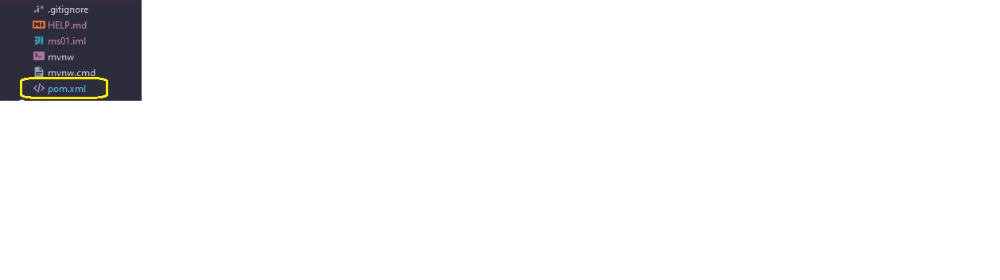
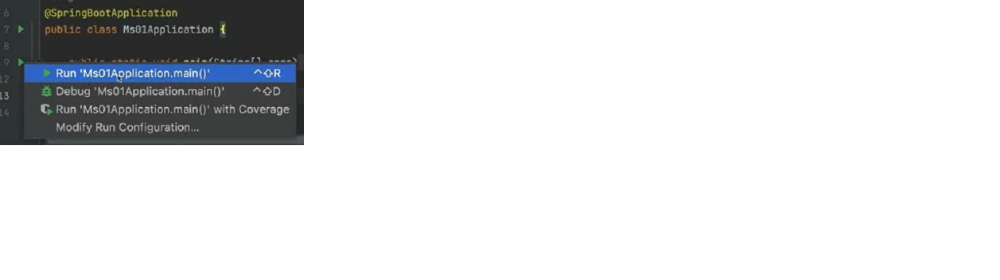
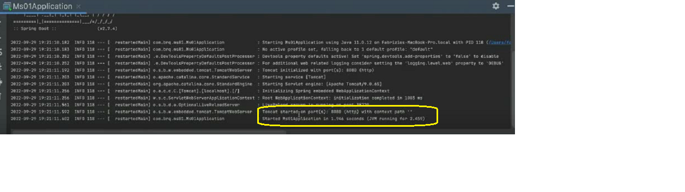
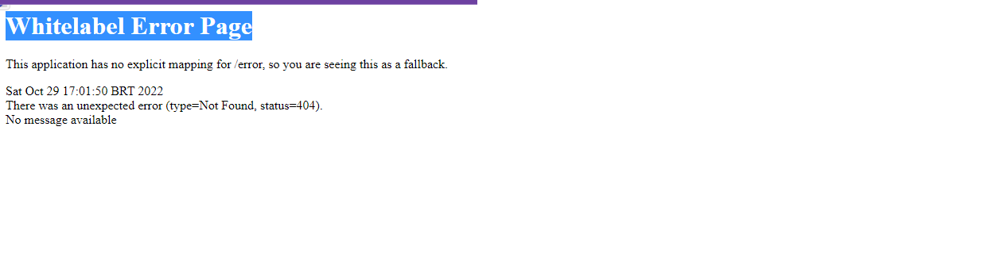
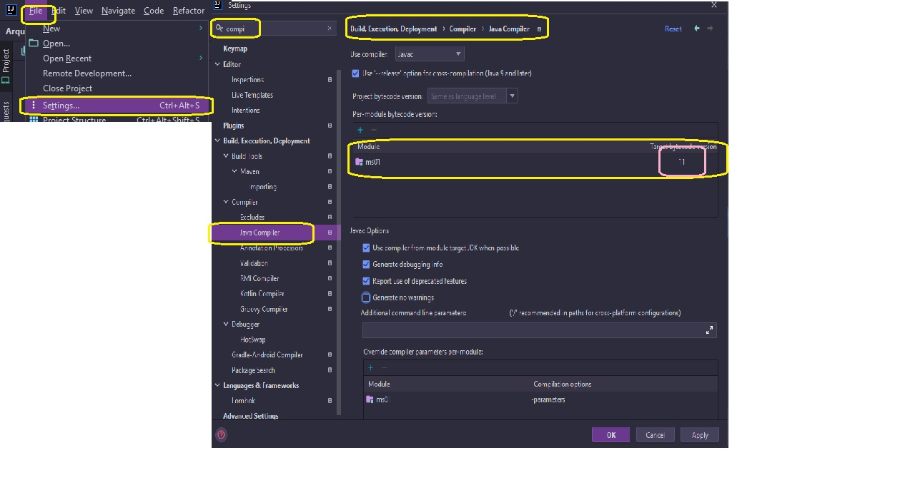
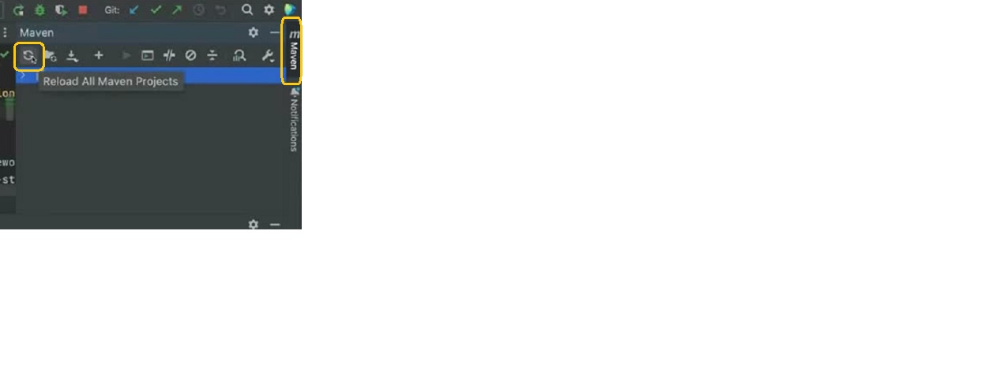
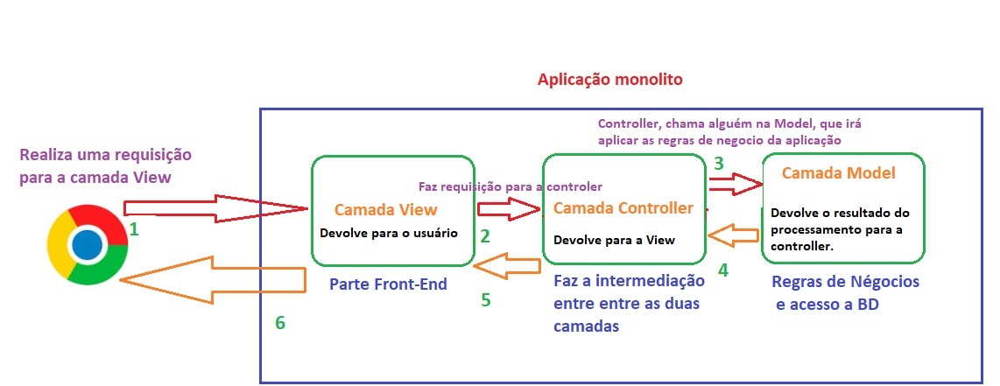
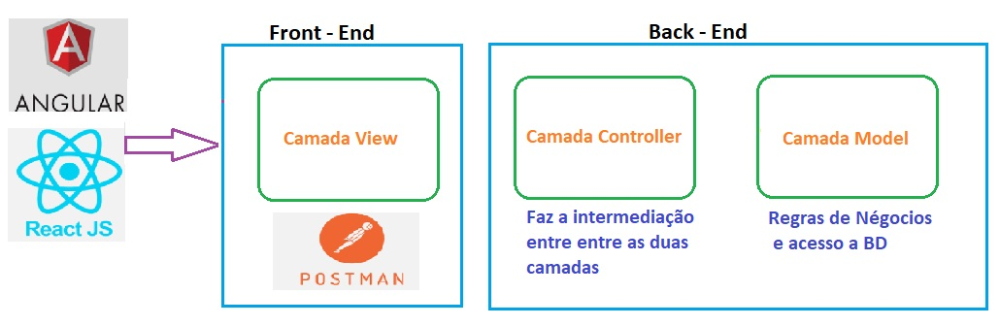

<h2 align = "center" >Aula 11  - Arquitetura - 29/09/2022<h2>

<h3 align = "center" ><a href="https://github.com/ffborelli/curso-brq-java-2022-09-05">Professor: Fabrizio Borelli</a></h3>
</br></br>

# Objetivo da Aula
- Arquivo pom.xml
- pacotes
- Classe Ms01Aplication

## Revisão

**API** : basicamente é um mecanismo onde fornecemos uma comunicação de um serviço.
**CRUD**: Conceito de CRUD ==> Utiliza os verbos:
**GET**: Pega as informações 
**PUT** / PATCH : Altera as informações
**POST**: Enviar uma nova informação
**DELETE**: Deleta uma informação

- As requisições são padronizadas, não importando se são diparadas pelo Postman - IOS ou outro aplicativo JAVA, fazendo que seja este o ponto chave da linguagem.

- Para fazer o nosso micro serviço em JAVA, vamos utilizar o framework **Spring Boot**, que tem o objetivo de acelerar o desenvolvimento de um micro serviço em JAVA.

- Criação do template ms01, com código padronizado para um micro serviço.

## Arquivo pom


É um arquivo de configuração das **dependencias** do projeto.
- **Dependencias**, são pequenas bibliotecas JAVA, do **SB**(_Spring Boot_) acessa atraves do repositório central, baixa e faz que o projeto funcione. O MAVEN, que é o gerenciador de dependencias, lê o arquivo e baixa tudo que for necessario para o processamento do projeto.
As depencias ficam todas dentro da tag <**dependeces**>

# Maven

É um gerenciador de dependências, significa que é uma assinatura do MAVEN, assim já podemos concluir que o projeto tem como gerenciador de dependencia o **MAVEN**. 

Observar arquivo pom.xml


- **spring-boot-starter-web** Necessaria para criar a camada de exposição do serviço (aka, permitir export nossos endpoint) das interfaces de API.


```
<dependency>
	<groupId>org.springframework.boot</groupId>
	<artifactId>spring-boot-starter-web</artifactId>
</dependency>

```
- Um **endpoint** é um recurso que podemos _**disponibilizar / expor**_ nossas **entidades** para uso (ex: /professores da grande porte)

## spring-boot-devtools

Quando terminamos de codificar, essa dependencia já restarta o micro serviço.
Ajuda a aumentar a velocidade de desenvolvimento. 

## spring-boot-starter-test

Responsável por fazer testes unitários na aplicação.

```
<dependency>
	<groupId>org.springframework.boot</groupId>
	<artifactId>spring-boot-devtools</artifactId>
	<scope>runtime</scope>
	<optional>true</optional>
</dependency>

```

- Um **teste unitário**  testa individualmente cada trecho de código. 
Este teste é automatizado e criado pelo desenvolvedor da aplicação. 

```
<dependency>
	<groupId>org.springframework.boot</groupId>
	<artifactId>spring-boot-starter-test</artifactId>
	<scope>test</scope>
</dependency>

```

## Classe Ms01Aplication

Método principal do JAVA.
Possui o metodo MAIN, que indica para a aplicação por onde ela deve iniciar.
Para rodar a aplicação:

Quando apertamos o play, startamos o nosso micro serviço na porta 8080 por padrão(pode ser alterado). 

Para confirmar que o serviço está rodando na porta informada, podemos abrir o browser http://localhost:8080/
Vamos receber o retorno: **Whitelabel**(_etiqueta_) **Error Page**, que indica que está OK!

<span style="font-family:Papyrus; font-size:2em;color: red">IMPORTANTE!</span>

**Sempre** dar prioridade a usar versões **LTS** (acrônimo em inglês de long-term support) suporte de longo prazo, é um tipo especial de versionamento de software ou uma edição de um software, projetada para designar algo que terá suporte por um período maior que o normal.
É um conceito presente em alguns programas que normalmente atuam nos “bastidores” do mundo digital — sistemas operacionais ou ferramentas de criação, por exemplo — e que demandam maior confidencialidade, integridade e disponibilidade no cotidiano.
Quando um software está na sua versão **LTE**, a frequência de atualizações e ciclo de vida são diferentes: os desenvolvedores se comprometem com o suporte ao aplicativo por um período prolongado, algo que se estende por anos na maioria dos exemplos. O pacote inclui uma seleção de ferramentas que se mostraram mais seguras, estáveis e indispensáveis para o aplicativo.

## Configuração do projeto

É importante que a configuração de nivel de linguagem do **projeto** esteja compativel com a configuração de nivel de linguagem do **módulo** e as properties do **arquivo.pom**, assim mantemos a unificação do projeto.


```
<properties>
	<java.version>11</java.version>
</properties>

``` 
 - $\textcolor{#BA55D3}{\text File > Project Structure > Project}$ 
 - $\textcolor{#BA55D3}{\text File > Project Structure > Module}$ 


## Configuração Geral


$\textcolor{#BA55D3}{\text File > Settings > Build,Execution,Deployment > Compiler > Java Compiler}$ 



## Forçar download de dependencias do Maven

Se o Maven não for as dependencias do arquivo.pom busca-las o projeto não funciona.



# Design Patterns (Padrões de Projeto)
São padrões estipulados por uma comunidade com o objetivo de auxiliar a desenvolver uma arquitetura de software **padronizada** e que evite "certos problemas"
Utilizamos <span style="font-family:Papyrus; font-size:1.06em;color: #FF4500">Padrões de projeto</span> para evitar erros conhecidos e também facilitar o entendimento do projeto

 No cenário de estrutura de uma aplicação, temos o padrão de projeto conhecido como <span style="font-family:Papyrus; font-size:1em;color: #FF4500">MVC</span>
 O **MVC** divide a nossa aplicação em 3 grandes camadas, com responsabilidades específica.

* <span style="font-family:Papyrus; font-size:1em;color: #A020F0">M:  </span>  Model
   * Na camada **Model** encontramos as regras de negócio e acesso ao banco de dados
* <span style="font-family:Papyrus; font-size:1em;color: #A020F0">V: </span> View
    * Na camada **View**, é a parte de visualização para o usuário (não veremos neste curso) 
* <span style="font-family:Papyrus; font-size:1em;color: #A020F0">C: </span> Control
    * Na camada controller, encontramos a **ligação** entre as camadas **Model** e **View**

No antigo padrão chamado **Monolito** não havia padrão definido, o que gerava uma bagunça de arquivos, misturas de front com back, o que dificulta a manutenção, então foi pensado em padronizar os projetos com a finalidade de corrigir tais dificuldades e facilitar manutenção.



No Padrão **MVC**, agora desaclopamos em módulos Front e Back, podemos utilizar varias linguagens e seus frameworks para cada módulo e a comunicação agora se dá por **API Rest**.
**APIs** são mecanismos que permitem que dois componentes de software se comuniquem usando um conjunto de definições e protocolos. Por exemplo, o sistema de software do instituto meteorológico contém dados meteorológicos diários. O aplicativo meteorológico em seu telefone "fala" com este sistema por meio de APIs e mostra atualizações meteorológicas diárias no telefone.

Neste curso a nossa camada de **VIEW** sera abordada com o **Postaman**



## Inicio da construção dos módulos de back e front

O Spring por padrão segue o pardão MVC, mas bem mais focado no no **C** e no **M**
Nosso micro serviço, irá rodar em  containner Docker, sendo containner para back e outro containner para front.

Basicamente para contruir um micro serviço precisamos criar a camada que receberá as chamadas externas(**requisições / request**) de outros sistemas, processar e devolver uma resposta(**response**).

#### Passo 1:
* Camada Controller 
    * Criar o **pacote** controllers
       * Pacotes sempre no **plural** e com **letras minusculas**
       * $\textcolor{#BA55D3}{\text File > New > Package }$ 
       * Vamos nomear de **controllers**
    * Dentro do pacote, criamos os nossos controllers
        * cada controller é uma classe java, responsavel por manipular todas as requisições que virão referentes a usuário
        * Nome de classe sempre inicia com letra **Maiuscula** com padrão CamelCase
        * $\textcolor{#BA55D3}{\text File > New > Java Class  }$
        * Vamos dar o nome de UsuarioController

* Para o Spring reconhecer / entender que nossa classe é um controller, precisamos usar notações( palavras chaves que vamos colocar em nossos arquivos para sinalizar o que o arquivo faz.)
    * Anotações do Spring Boot
        * **@RestController:** anotação que permite a classe em questão manipular requisições do tipo REST API
<span style="font-family:Papyrus; font-size:1.5em;color: #FF4500">Obs: todo endpoint da camada de controller deve ser mapeado com um método
</span>      

```
import org.springframework.web.bind.annotation.*;

@RestController
public class UsuarioController {

}
```
A notação **@RestController**, diz que a requisição Rest vão passar pela classe **UsuarioController**, dessa forma diminuimos bastante a quantidade de código e acelera o desenvolvimento.

Vamos criar o metodo get para /usuarios e vamos retornar algo pra ele.


```
import org.springframework.web.bind.annotation.*;

@GetMapping("usuarios")
public String getAllUsuarios(){
    return "GET Usuários";
}

```
A notação **@GetMapping**, sinaliza para o Spring que quando houver o verbo **GET**, deve ser mapeado com o metodo logo abaixo. O parametro ("usuarios") é a rota ou seja, **/usuarios**(http://localhost:8080/usuarios)


## Testar chamada GET

Podemos testar via navegador ou via Postman.


