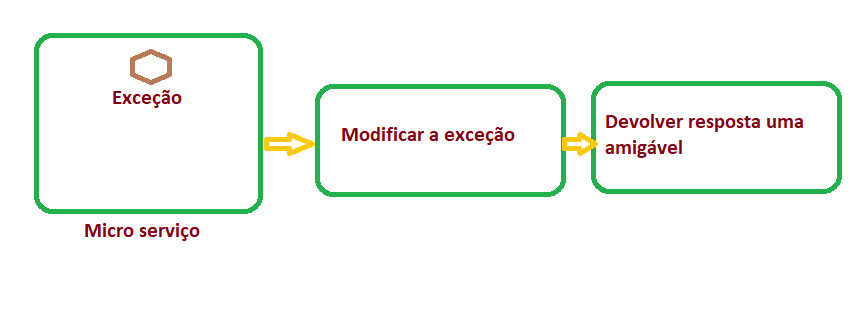
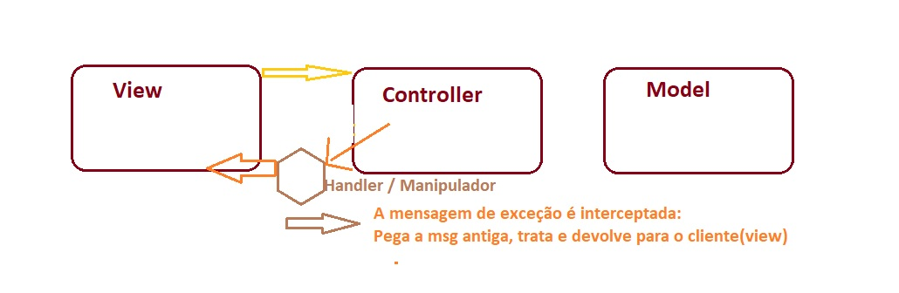
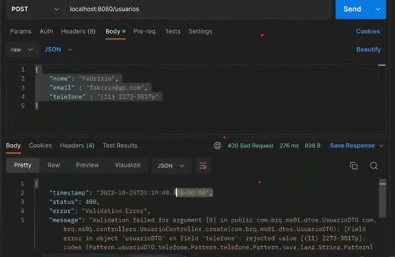
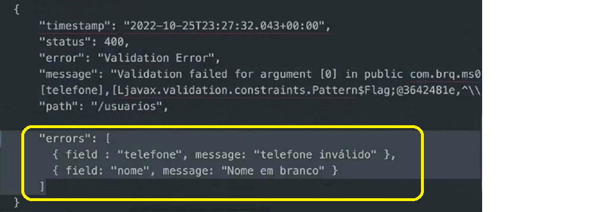
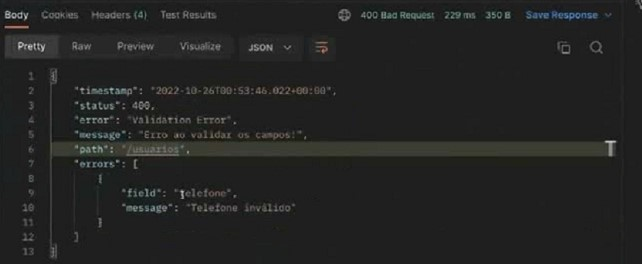

<h2 align = "center" >Aula 22  - Arquitetura - 25/10/2022<h2>

<h3 align = "center" ><a href="https://github.com/ffborelli/curso-brq-java-2022-09-05/">Professor: Fabrizio Borelli</a></h3>
</br></br>

# Revisão
- ResponseEntity<>
- Anotations
- Validações

# Objetivo da Aula
- Melhorar as msgs de erro
- Tratar exceções
- Mensagens de retorno personalizada

# Exceções

O Spring possui um mecanismo que fica ouvindo alguns tipos de exceções, e quando as exceções ocorrem podemos interceptar e tratar.
Fluxo: Micro serviço lança a exceção - Modificamos a exceção e soltamos uma resposta amigavel.



Para realizar o tratamento de exceções usamos a anotação **@ControllerAdvice**

Usaremos como estrategia criar um novo pacote com nome: exceptions e vamos separar o que são tratamentos de exceções.

# Anotations

O método abaixo vai tratar exceções do tipo de validação de dados.
Exceção do tipo **MethodArgumentNotValidException**, o Spring ao invés de retornar a exceção, irá passar pelo método abaixo que tem a proposta de interceptar a exceção, tratar (vamos modificar seu comportamento ) e depois exibir de forma amigavel no Postman.

```
@ControllerAdvice
public class ResourceExceptionHandler {

}

```

**@ControllerAdvice** Afirmamos para o Java que podemos manipular as exceções de forma global.
 * Para cada tipo de exceção, podemos manipular desde o status  até a mensagem de retorno

 **@ExceptionHandler(MethodArgumentNotValidException.class)** Pede que o método abaixo trate exceções do tipo de validação de dados
 Precisamos passar no parametro o tipo da exceção
 **(MethodArgumentNotValidException.class)** que deve ser capturada, com a finalidade de sinalizar para o Spring que quando ocorrer esse tipo de exceção, ela deve passar pelo método abaixo:
 
```
@ControllerAdvice
public class ResourceExceptionHandler {

    @ExceptionHandler(MethodArgumentNotValidException.class)
    public void methodValidatitionHandler(){

    }

}

```
Para tratar o retorno, precisamos identificar quais dados(atributos) precisamos, criar uma classe(no pacote exceptions - classe: StandardError ==> erro padrão ) com esses atributos, e quando retornar os objetos dessa nova classe.
- private Long timestamp;
- private Integer status;
- private String error;
- private String message;
- private String patch;

Para os getters, seters, contrutores, usaremos sempre o combo de decorations abaixo:

```
import lombok.AllArgsConstructor;
import lombok.Builder;
import lombok.Data;
import lombok.NoArgsConstructor;


@Builder //Uma forma de construção onde ocorre a instanciação de uma classe e o uso de todos os getters e setters de forma mais elegante.
@Data //Substitui os Getters, Setters, RequiredArgsConstructor,toString, EqualsAndHashCode e Value
@AllArgsConstructor//Construtor com todos os atributos
@NoArgsConstructor//Construtor padrão vazio
public class StandardError {

	protected Date timestamp;
	protected Integer status;
	protected String error;
	protected String path;
	protected String message;

}
```
Agora precisamos instanciar um objeto da classe **StandardError** na classe **methodValidationHandler**, neste caso vamos usar a instanciação via **@Builder** 

```
StandardError standardError = StandardError
			                              .builder()
			                              .status(400)
			                              .path(request.getRequestURI())
			                              .build();

```

O Status não devemos inserir manualmente, pois existe a classe do Spring com todos os possiveis status

```diff
StandardError standardError = StandardError
.builder()
+.status(HttpStatus.BAD_REQUEST).				                              
.error()
.path()
.build();

```

Agora vamos resolver o Timestamp, usando o tempo da máquina

```diff
StandardError standardError = StandardError
.builder()
+.timestamp(new Date(System.currentTimeMillis() ))
.status()			       
.path()
.build();

```
Vamos resolver o Error:
Como eu pego o erro original?
Vamos passar via argumentos:
1. A exceção
2. A requisição que estamos fazendo


```diff
+ import javax.servlet.http.HttpServletRequest;

@ExceptionHandler(MethodArgumentNotValidException.class)
+public void  methodValidationHandler(MethodArgumentNotValidationException exception, HttpServeletRequest request){

StandardError standardError = StandardError
.builder()
.timestamp(new Date(System.currentTimeMillis() ))
.status(HttpStatus.BAD_REQUEST.value())				       
+.error(exception.getMessage())
.path("")
.build();

}

```

Agora vamos tratar o Message

```diff
import javax.servlet.http.HttpServletRequest;

@ExceptionHandler(MethodArgumentNotValidException.class)
	public void  methodValidationHandler(MethodArgumentNotValidationException exception, HttpServeletRequest request){

StandardError standardError = StandardError
.builder()
.timestamp(new Date(System.currentTimeMillis() ))
.status(HttpStatus.BAD_REQUEST..value())
.error("Validation Error")
+.message(exception.getMessage())
+.path(resquest.getRequestURI())//Pega o /usuarios
.build();
}

```
Com o objeto criado, precisamos retornar ele para o Postman.
**Lembrando** que estou retornando o objeto standardError, assim meu retorno não pode mais ser um void.

```diff
import javax.servlet.http.HttpServletRequest;

@ExceptionHandler(MethodArgumentNotValidException.class)
  
+public standardError  methodValidationHandler(MethodArgumentNotValidationException exception, HttpServeletRequest request){

StandardError StandardError = StandardError
		.builder()
		.timestamp(new Date(System.currentTimeMillis() ))
		.status(HttpStatus.BAD_REQUEST.
		.error()
		.path()
		.build();

+return standardError;    

}

```

Para finalizar
O retorno do controller agora será o generics da classe **ResponseEntity <>**.
Quando retorno o **ResponseEntity <StandartError>**. de uma classe, ele vai pegar os dados vindos da classe informada entre **<>** e vai colocar alguns dados da requisição, assim no Postman precisa da classe ResponseEntity, por recomendação do Spring.

* **ResponseEntity** permite retornar o status, headers e o body da requisição para o cliente.

* Não posso mais retornar _standardError_, agora preciso retornar **ResponseEntity**

```diff
import javax.servlet.http.HttpServletRequest;
+import org.springframework.http.ResponseEntity;

@ExceptionHandler(MethodArgumentNotValidException.class)

+public ResponseEntity<standardError>  methodValidationHandler(MethodArgumentNotValidationException exception, HttpServeletRequest request){

StandardError StandardError = StandardError
		.builder()
		.timestamp(new Date(System.currentTimeMillis() ))
		.status(HttpStatus.BAD_REQUEST.
		.error("Validation Error")
		.message(exception.getMessage())
		.path(request.getRequestURI())
		.build();

+return ResponseEntity.status(HttpStatus.BAD_REQUEST).body(validationError);   

}

```
Ao realizar a primeira simulação identificamos que a data retornada no **timestamp**, não é amigavel, então vamos realizar esse ajuste:


Na classe StandartError vamos alterar o tipo de **Long** para **Date**

```diff

package com.brq.ms01.exceptions;

import lombok.AllArgsConstructor;
import lombok.Builder;
+import lombok.Data;
import lombok.NoArgsConstructor;

import java.util.Date;

@Builder //Uma forma de construção onde ocorre a instanciação de uma classe e o uso de todos os getters e setters de forma mais elegante.
@Data //Pega entre outros os Getters e Setters
@AllArgsConstructor//Construtor com todos os atributos
@NoArgsConstructor//Construtor padrão vazio
public class StandardError {

+protected Date timestamp;
protected Integer status;
protected String error;
protected String path;
protected String message;

}

```

Maravilha.....
Agora simulamos o erro passando um dado errado(telefone com letra) na requisição 



# Refatoração da exceção

Agora que entendemos a logica por tras do tratamento de uma exceção, podemos realizar melhorias em nosso código, deixando-o mais amigavel.

- Vamos criar mais um atributo do tipo array para guardar todos os nossos erros.

- Criamos uma nova classe ==> **ValidationError** 
È mais interessante criarmos uma nova classe para os erros, do que criar um novo atributo.
Assim a classe ValidationError, herdar da classe StandartError

```
import lombok.AllArgsConstructor;
import lombok.Builder;
import lombok.Data;
import lombok.NoArgsConstructor;

import java.util.ArrayList;
import java.util.List;


@Data //Pega entre outros, os Getters e Setters
@AllArgsConstructor
@NoArgsConstructor
public class ValidationError extends StandardError {

	

}

```

- O nosso desejo é obter algo assim:


- A Classe FieldMessage, vai guardar o objeto field e message;
- A Classe ValidationError, vai guardar "erros"

```
import lombok.AllArgsConstructor;
import lombok.Data;
import lombok.NoArgsConstructor;

@Data
@AllArgsConstructor
@NoArgsConstructor
public class FieldMessage {

	private String field;
	private String message;

}

```

- A classe ValidationError, possui o atributo erros, que é uma lista de field message.
Precisamos criar essa lista, conforme destacado abaixo:

```diff
import lombok.AllArgsConstructor;
import lombok.Builder;
import lombok.Data;
import lombok.NoArgsConstructor;

import java.util.ArrayList;
import java.util.List;

@Builder
@Data //Pega entre outros, os Getters e Setters
@AllArgsConstructor
@NoArgsConstructor
public class ValidationError extends StandardError {

+ private List<FieldMessage> errors = new ArrayList<>();

}

```
- Vamos voltar a classe **ResourceExceptionHandler**, e precisamos alterar a instanciação de **StandartError** para **ValidationError**, porquê é essa classe que possui os erros agora.
- <span style="font-family:Papyrus; font-size:1.5em;color: #FF4500">Devido a um erro generalizado, aparentemente por causa da anotação **@Builder**, não estamos utilizando por hora.</span>


```diff
import javax.servlet.http.HttpServletRequest;
import org.springframework.http.ResponseEntity;

@ExceptionHandler(MethodArgumentNotValidException.class)

public ResponseEntity<standardError>  methodValidationHandler(MethodArgumentNotValidationException exception, HttpServeletRequest request){

-StandardError StandardError = StandardError
-	.builder()
-	.timestamp(new Date(System.currentTimeMillis() ))
-	.status(HttpStatus.BAD_REQUEST.
-	.error("Validation Error")
-	.message(exception.getMessage())
-	.path(request.getRequestURI())
-	.build();

-return ResponseEntity.status(HttpStatus.BAD_REQUEST).body(validationError);   

========================================================
+ValidationError validationError = new ValidationError();

+	validationError.setTimestamp(new Date( System.currentTimeMillis() ));
+	validationError.setStatus(HttpStatus.BAD_REQUEST.value());
+	validationError.setError("Validation Error");
-	//validationError.setMessage(exception.getMessage());
+	validationError.setMessage("Erro ao validar os campos!");
+	validationError.setPath(request.getRequestURI());


!todos os erros vindo da exceção
		
List<FieldError> listErrors = exception.getBindingResult().getFieldErrors();

!para cada erro da exceção:
		for ( FieldError err : listErrors  ){

!crio um obj FieldMessage com o nome do campo e o erro retornado do mesmo

	FieldMessage fm = new FieldMessage();
	fm.setField(err.getField());
	fm.setMessage(err.getDefaultMessage());

!adiciono o campo, e seu respectivo erro no atributo ERRORS do retorno
	validationError.getErrors().add( fm );

+ return ResponseEntity.status(HttpStatus.BAD_REQUEST).body(validationError);


		}

}

```
- Resultado alcançado.




