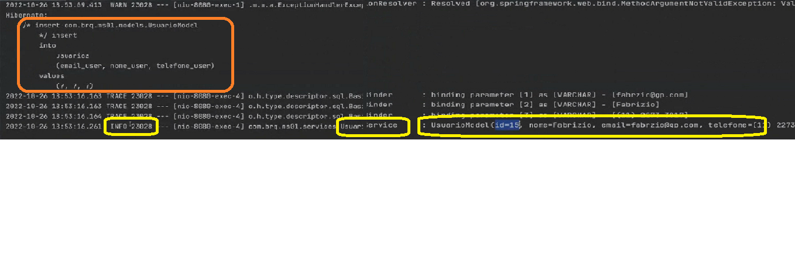
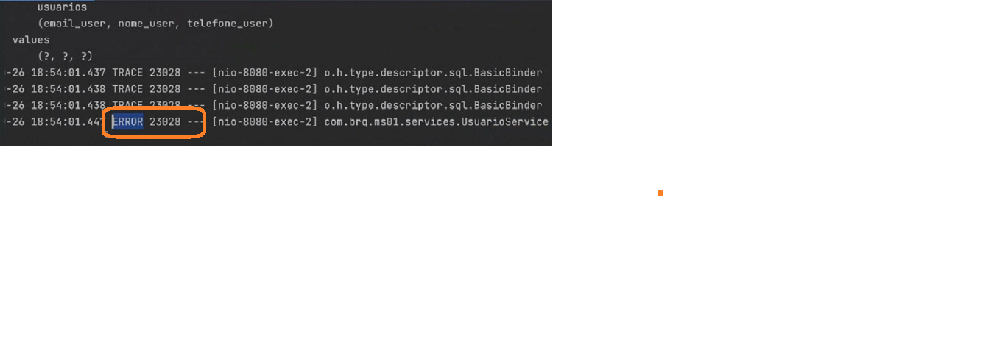
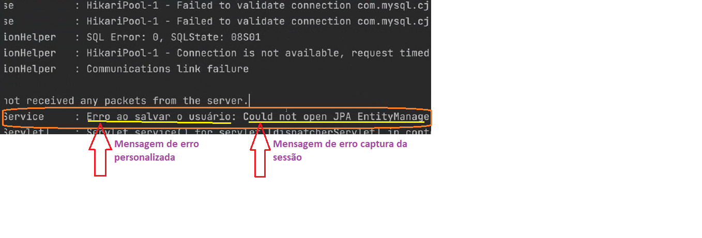

<h2 align = "center" >Aula 23  - Arquitetura - 26/10/2022 - Quarta - Feira<h2>

<h3 align = "center" ><a href="https://github.com/ffborelli/curso-brq-java-2022-09-05/">Professor: Fabrizio Borelli</a></h3>
</br></br>

# Revisão
- **@ControllerAdivice**
  - Mecanismo para interceptar de forma global as exceções do JAVA.
  - Criar uma classe com a notação **@ControllerAdivice**, dentro da classe através da notação **@ExceptionHandler**, vamos informar que o método vai tratar todas as exceções do tipo **MethodArgumentNotValidException**, a notação **@ExceptionHandler**, vai interceptar a exceção e entrar no método para realizar o processamento da captura.
  - No processamento do metodo, vamos colocar todos os atributos que é do nosso interesse realizar tratamento. 
  - Se criarmos outros controller(ex:ProdutoController), já estará coberto pelo processamento da exeção **MethodArgumentNotValidException**, desde que aplicado a validação no DTO.
- Introdução sobre como escrever logs. O lombok possui a notação **@Slf4j**, que basicamente instancia um objeto do tipo logger.

# Objetivo da Aula
- Refatoração de logs
- Criar uma nova tabela para uso de chave estrangeira

# Logs
## log.info
- Como gerar logs sempre que um usuário for criado na classe UsuarioService?

1. Ir a Classe UsuarioService e colocar a notação: **@Slf4j**
2. No método criate logo após o término da criação do usuário e antes do return adicionar o comando:
 2.1. **log.info(usuarioSalvo.toString());** ==> Significa que estamos capturando o usuário criado, convertendo em uma String e exibindo no log.
3. No Postman, enviar um novo usuário para criação(POST).


```diff 
public UsuarioDTO create(UsuarioDTO usuario){

	UsuarioModel usuarioSalvo = null;

		
			usuarioSalvo = usuRepository.save( usuario.toModel() );
+                       log.info(usuarioSalvo.toString());

			return usuarioSalvo.toDTO();
		  
        
```


## log.error

1. Realizar o procedimento do log.info.
2. No passo:
   2.1. **log.error(usuarioSalvo.toString());**
3. No Postman, enviar um novo usuário para criação(POST).


#### Quando e onde usar o logError?

- Quando cair no Catch: é de bom tom adicionar o log de Erro.
- log.error("Erro ao salvar o usuário: " + exception.getMessage()); ==> Vai capturar o erro, e registrar a mensagem: "Erro ao salvar o usuário: " adicionando o erro informado na sessão.

```diff 
public UsuarioDTO create(UsuarioDTO usuario){

	UsuarioModel usuarioSalvo = null;

+           try{
		usuarioSalvo = usuRepository.save( usuario.toModel() );
                log.info(usuarioSalvo.toString());

			return usuarioSalvo.toDTO();
		    }
+           catch (Exception exception){
+               log.error("Erro ao salvar o usuário: " + exception.getMessage());
			
			throw new DataCreateException("Erro ao salvar usuário");
		}     
        
```
- <span style="font-family:Papyrus; font-size:2em;color: #FF4500">Os logs devem ser utilizados nas camadas gerenciada pelo Spring:
  - Service;
  - Repository
  - Controller.</span>

#### Simulando um erro ao criar o usuário.

1. Paramos o banco de dados;
2. Enviamos uma nova criação via Postman;
3. Verificamos os logs da aplicação.



#### Padronizar os logs

- O arquivo abaixo, e contido no projeto, é apenas um modelo de como fazer.
<span style="font-family:Papyrus; font-size:2em;color: #FF4500"> Main > Resources ==> Botão direiro do mouse > New > File
- logback-spring.xml</span>
- Definir padrões:
    - <pattern>
        {
         "severity": "%level",
         "service": "${appName:-}",
         "@version": "${project.version}",
         "trace": "%X{X-B3-TraceId:-}",
         "span": "%X{X-B3-SpanId:-}",
         "parent": "%X{X-B3-ParentSpanId:-}",
         "exportable": "%X{X-Span-Export:-}",
         "pid": "${PID:-}",
         "thread": "%thread",
         "class": "%logger{40}",
         "message": "%message"
        }


