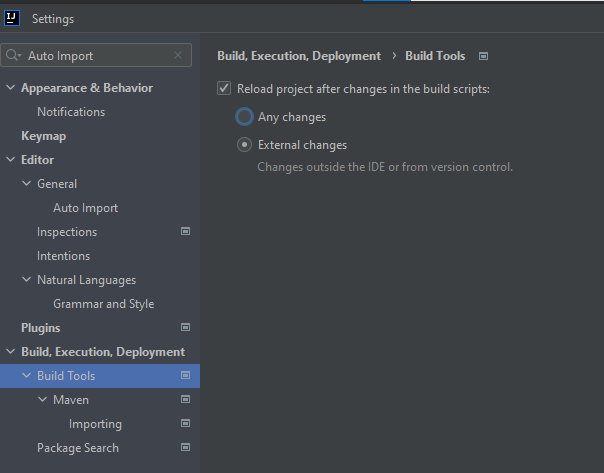

# Intellij Community

### Encontrar configuração

- CTRL+SHIFT+A

### Configurações essenciais de aparência:

 - File -> Settings -> Appearance & Behavior -> Appearance
  - - File -> Settings -> Editor -> General -> Change font size with Ctrl+Mouse Wheel
   - File Atalho ==> CTRL + Shift + A ==> Digite por exemplo Wheel e já estará nas configurações.

### Acesso à pasta do Linux
 - Settings/Preferences (Ctrl+Alt+S) -> Build, Execution, Deployment -> Trusted Locations
  (adicionar pasta dos projetos)

### Para executar um projeto

É preciso criar um configuração de execução para rodar um projeto

- Add configuration
- Botão "Play"

### Limpar cache e outros
 - File -> Invalidate Caches / Restart

- Apagar subpasta Jetbrains em ~/.cache

### Edição

- CTRL+Espaço (auto completar)
- ALT+INSERT (criar construtor, get/set, etc.)
- CTRL+ALT+L (auto-indentação)
- Settings/Preferences (Ctrl+Alt+S) -> Editor -> General -> Auto Import (Add unambiguous imports on the fly / Optimeze imports on the fly)
- Auto-reload ==> CTRL+SHIFT+A ==> Auto-reload Projects

