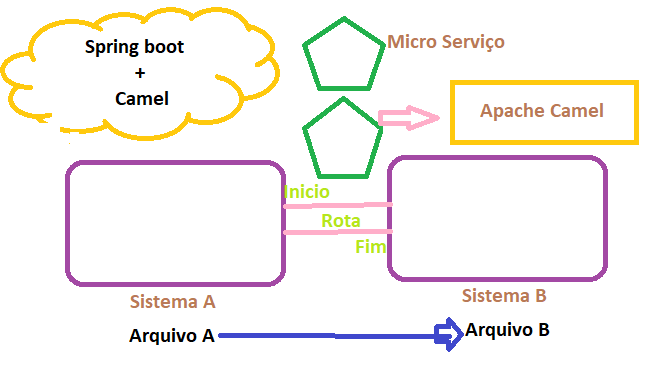

<h2 align = "center" >Aula 32  - Arquitetura - 07/11/2022 - Segunda - Feira<h2>

<h3 align = "center" ><a href="https://github.com/ffborelli/curso-brq-java-2022-09-05/">Professor: Fabrizio Borelli</a></h3>
  

# Introdução ao Camel

## Objetivo

- Integre sistemas com Apache Camel
- Entenda a rotas e endpoints
- Segue boas práticas usando padrões de integração
- Conecte endpoints REST, SOAP e JMS
- Transforme e filtra mensagens com XPATH e XSLT

O que é o Camel?

**Apache Camel:** é o framework de integração entre sistemas.
O livro mais famoso “Enterprise Integration Patterns” descreve as boas práticas na integração. O Apache Camel, justamente, implementa a maioria desses padrões. Apache Camel é uma mão na roda das integrações, ele vai te ajudar a lidar com todos esses formatos e protocolos, seguindo essas boas práticas desses padrões de integração.
Podemos pensar de forma simplificada que ele é um entregador de correios. Ele pega os dados de um lugar e envia para outro. Você fala para onde vai e de onde vem, usando uma linguagem de alto nível.
De vez em quando você quer pegar os dados de um banco de dados e enviar para algum serviço e para uma fila , ou escrever um arquivo em algum lugar. Então você pode falar para esse entregador para mandar esses dados para dois lugares.
Eu posso falar para o entregador pegar os dados de dois lugares e juntar eles. Agora, com isso eu posso manipular os dados, transformar os dados, filtrar as informações. Eu posso dividir o conteúdo, pegar esse envelope grande e dividir em sub mensagens, fazer validações e transformações... A lista é longa.
Então com o **Apache Camel** você define esses passos que os dados vão fazer entre as ocupações de alto nível. Você fala que define uma rota. O Apache Camel é uma **“roating engine”**, uma máquina de roteamento, é isso que você faz com ele. No meio desse roteamento você faz essas transformações, filtra e divide o conteúdo.
Essas configurações _(de onde vem os dados e para onde vão)_ são feitas através de uma linguagem de alto nível, que se chama **Camel DSL**. **“DSL” **significa: “**Domain Specific Language”**, uma linguagem especifica para definir essas integrações, são métodos que chamamos no final de **“from”**, que é de onde vem os dados no meio termo entre “from” e **“to”** (onde vão os dados).
Agora  posso fazer essas transformações, filtros, splits, aggregations. O Camel é  grande ajuda na integração de alto nível para trabalhar com todos esses padrões e protocolos.

Na imagem imagem, temos um exemplo de integração entre sistemas, a principio poderiamos criar um micro serviço com Spring, mas vamos usar o framework especializado em realizar a integração de sistemas, utilizando o conceito de rota:
Rota no Camel - **“roating engine”**: que é o que foi exlicado nas linhas acima:
**“from”**, que é de onde vem os dados
**“to”** (onde vão os dados).
Para a nossa necessidade, vamos utilizar com os seguintes propositos:
- Postar em fila MQ
- CRUD em microServiços
- Integração com SOA API
- Consulta no REDIS

## Criando um novo projeto _ms04_

- A **mensagem** contém dados que serão transferidos para uma rota. Cada mensagem tem um identificador exclusivo e é construído a partir de um corpo, cabeçalhos e anexos.

- **Exchange** é criado quando uma mensagem é recebida por um consumidor durante o processo de roteamento. Este permite capturar dados da mensagem trocada entre a rota.

- **Endpoint** é um canal através do qual o sistema pode receber ou enviar uma mensagem. Ele pode se referir a um URI de serviço da Web, URI de fila, arquivo, endereço de e-mail, etc.

- **Processor** é uma interface Java que é usada para adicionar lógica de integração personalizada a uma rota. Ele contém um único método de processo usado para pré-formar a lógica de negócios personalizada em uma mensagem recebida por um consumidor.