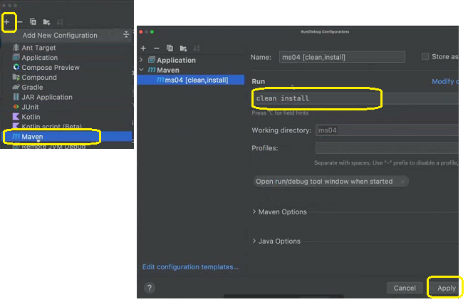

<h2 align = "center" >Aula 32  - Arquitetura - 07/11/2022 - Segunda - Feira<h2>

<h3 align = "center" ><a href="https://github.com/ffborelli/curso-brq-java-2022-09-05/">Professor: Fabrizio Borelli</a></h3>
</br></br>

# Introdução ao Camel

## Objetivo

- Integre sistemas com Apache Camel
- Entenda a rotas e endpoints
- Segue boas práticas usando padrões de integração
- Conecte endpoints REST, SOAP e JMS
- Transforme e filtra mensagens com XPATH e XSLT

<span style="font-family:Papyrus; font-size:2em;color: #A020F0">O que é o Camel?</span>

**Apache Camel:** é o framework de integração entre sistemas.
O livro mais famoso “Enterprise Integration Patterns” descreve as boas práticas na integração. O Apache Camel, justamente, implementa a maioria desses padrões. Apache Camel é uma mão na roda das integrações, ele vai te ajudar a lidar com todos esses formatos e protocolos, seguindo essas boas práticas desses padrões de integração.
Podemos pensar de forma simplificada que ele é um entregador de correios. Ele pega os dados de um lugar e envia para outro. Você fala para onde vai e de onde vem, usando uma linguagem de alto nível.
De vez em quando você quer pegar os dados de um banco de dados e enviar para algum serviço e para uma fila , ou escrever um arquivo em algum lugar. Então você pode falar para esse entregador para mandar esses dados para dois lugares.
Eu posso falar para o entregador pegar os dados de dois lugares e juntar eles. Agora, com isso eu posso manipular os dados, transformar os dados, filtrar as informações. Eu posso dividir o conteúdo, pegar esse envelope grande e dividir em sub mensagens, fazer validações e transformações... A lista é longa.
Então com o **Apache Camel** você define esses passos que os dados vão fazer entre as ocupações de alto nível. Você fala que define uma rota. O Apache Camel é uma **“roating engine”**, uma máquina de roteamento, é isso que você faz com ele. No meio desse roteamento você faz essas transformações, filtra e divide o conteúdo.
Essas configurações _(de onde vem os dados e para onde vão)_ são feitas através de uma linguagem de alto nível, que se chama **Camel DSL**. **“DSL” **significa: “**Domain Specific Language”**, uma linguagem especifica para definir essas integrações, são métodos que chamamos no final de **“from”**, que é de onde vem os dados no meio termo entre “from” e **“to”** (onde vão os dados).
Agora  posso fazer essas transformações, filtros, splits, aggregations. O Camel é  grande ajuda na integração de alto nível para trabalhar com todos esses padrões e protocolos.

Na imagem imagem, temos um exemplo de integração entre sistemas, a principio poderiamos criar um micro serviço com Spring, mas vamos usar o framework especializado em realizar a integração de sistemas, utilizando o conceito de rota:
Rota no Camel - **“roating engine”**: que é o que foi exlicado nas linhas acima:
**“from”**, que é de onde vem os dados
**“to”** (onde vão os dados).
Para a nossa necessidade, vamos utilizar com os seguintes propositos:
- Postar em fila MQ
- CRUD em microServiços
- Integração com SOA API
- Consulta no REDIS


## Criando um novo projeto _ms04_

Estamos criando do zero para relembrar, entretando poderiamos apenas clonar um projeto anterior.

Abrir o novo projeto nqa IDE Intellij.

## Adicionando dependencias

No arquivo.pom, abaixo da dependencia _spring-boot-starter-web_ vamos adicionar as dependencias para esse momento da aplicação.
- Apache Camel v3.5
- dependência do JPA para acesso ao banco de dados relacional
- H2: banco de dados em memória


<!--  Apache Camel v3.5  -->
        <dependency>
            <groupId>org.apache.camel.springboot</groupId>
            <artifactId>camel-spring-boot-starter</artifactId>
            <version>3.5.0</version>
        </dependency>

        <dependency>
            <groupId>org.apache.camel</groupId>
            <artifactId>camel-jackson</artifactId>
            <version>3.5.0</version>
        </dependency>

        <dependency>
            <groupId>org.apache.camel.springboot</groupId>
            <artifactId>camel-http-starter</artifactId>
            <version>3.5.0</version>
        </dependency>


        <dependency>
            <groupId>org.modelmapper</groupId>
            <artifactId>modelmapper</artifactId>
            <version>2.3.5</version>
        </dependency>

        <!-- dependência do JPA para acesso ao banco de dados relacional -->
        <dependency>
            <groupId>org.springframework.boot</groupId>
            <artifactId>spring-boot-starter-data-jpa</artifactId>
        </dependency>

        <!-- H2: banco de dados em memória -->
        <dependency>
            <groupId>com.h2database</groupId>
            <artifactId>h2</artifactId>
            <scope>runtime</scope>
        </dependency>


## Banco de Dados Relacional H2


<span style="font-family:Proggy; font-size:1.2em;color: #00FF7F">O objetivo principal aqui, é aprender uma ferramenta que auxilie no desenvolvimento, enquanto ainda não temos um BD modelado para linkar a aplicação ==> Essa situação ocorre geralmente no ínicio de um projeto.</span>


O aplicativo **H2 Console** permite acessar um banco de dados usando um navegador. Pode ser um banco de dados H2 ou outro banco de dados que suporte a API JDBC.
Este é um aplicativo cliente/servidor, portanto, um servidor e um cliente (um navegador) são necessários para executá-lo.

Podemos armazenar BD H2 em:
- **Memória:** Ao fechar o serviço, perdemos todos os dados.
- **Arquivo**:Criamos um arquivo simples na raiz do nossa aplicação, assim conseguimos persitir os dados. 

#### Persisitindo o BD

O local ideal para criar o arquivo de BD, é no pacote resources > arquivo application.properties

- spring.datasource.url=**jdbc:h2:file:./testdb:** estamos informando que usaremos o BD H2 e que ele ficará armazenado no arquivo com o nome **testdb**
- **spring.h2.console.enabled=true** ==> informa que o banco deverá ser aberto via console.

```
spring.datasource.url=jdbc:h2:file:./testdb
spring.datasource.driverClassName=org.h2.Driver
spring.datasource.username=sa
spring.datasource.password=password
spring.jpa.database-platform=org.hibernate.dialect.H2Dialect
spring.h2.console.enabled=true

<!-- Apresenta os SQLs conforme são gerados no Console da aplicação -->

spring.jpa.properties.hibernate.show_sql=true
spring.jpa.properties.hibernate.use_sql_comments=true
spring.jpa.properties.hibernate.format_sql=true
#printing parameter values in order
logging.level.org.hibernate.type.descriptor.sql=trace

```
- Vamos subir a aplicação


####  Firewall
Se você iniciar o servidor, poderá receber um aviso de segurança do firewall (se tiver instalado um). Se você não quiser que outros computadores na rede acessem o aplicativo em sua máquina, você pode permitir que o firewall bloqueie essas conexões. A conexão da máquina local ainda funcionará. Somente se você quiser que outros computadores acessem o banco de dados neste computador, você precisa permitir conexões remotas no firewall.

#### Várias sessões simultâneas
Várias sessões de navegador simultâneas são suportadas. Como os objetos de banco de dados residem no servidor, a quantidade de trabalho simultâneo é limitada pela memória disponível para o aplicativo do servidor.

Você pode salvar e reutilizar configurações salvas anteriormente. As configurações são armazenadas em um arquivo de propriedades ([consulte Configurações do console H2](http://www.h2database.com/html/tutorial.html#console_settings) ).

#### Desconectando e interrompendo o aplicativo
Para sair do banco de dados, clique em [Desconectar] no painel da barra de ferramentas. No entanto, o servidor ainda está em execução e pronto para aceitar novas sessões.

Para parar o servidor, clique com o botão direito do mouse no ícone da bandeja do sistema e selecione [Sair]. Se você não tiver o ícone da bandeja do sistema, navegue até [Preferências] e clique em [Desligar], pressione [Ctrl]+[C] no console onde o servidor foi iniciado (Windows), ou feche a janela do console.

Dependendo de sua plataforma e ambiente, há várias maneiras de iniciar o H2 Console:

- Uma janela do navegador deve abrir e apontar para a página de login em http://localhost:8082.

## Configuração do current file e Maven

O objetivo dessa configuração é para que a aplicação saiba qual a classe contem o método main.





- A **mensagem** contém dados que serão transferidos para uma rota. Cada mensagem tem um identificador exclusivo e é construído a partir de um corpo, cabeçalhos e anexos.

- **Exchange** é criado quando uma mensagem é recebida por um consumidor durante o processo de roteamento. Este permite capturar dados da mensagem trocada entre a rota.

- **Endpoint** é um canal através do qual o sistema pode receber ou enviar uma mensagem. Ele pode se referir a um URI de serviço da Web, URI de fila, arquivo, endereço de e-mail, etc.

- **Processor** é uma interface Java que é usada para adicionar lógica de integração personalizada a uma rota. Ele contém um único método de processo usado para pré-formar a lógica de negócios personalizada em uma mensagem recebida por um consumidor.