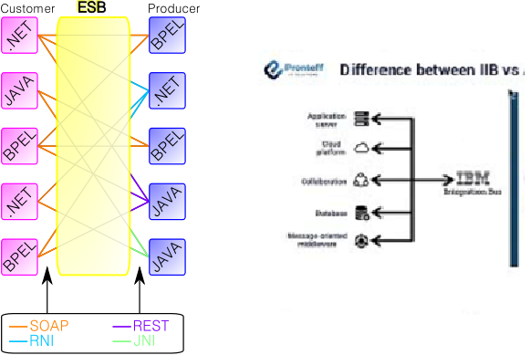
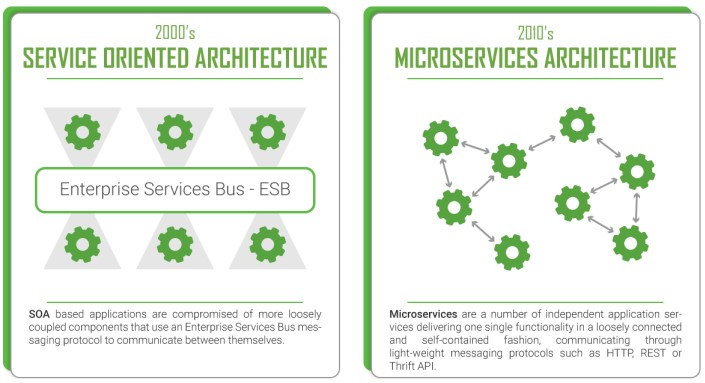
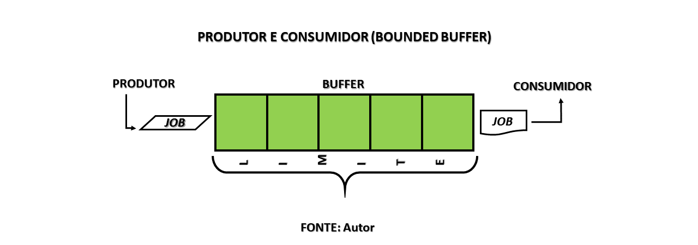
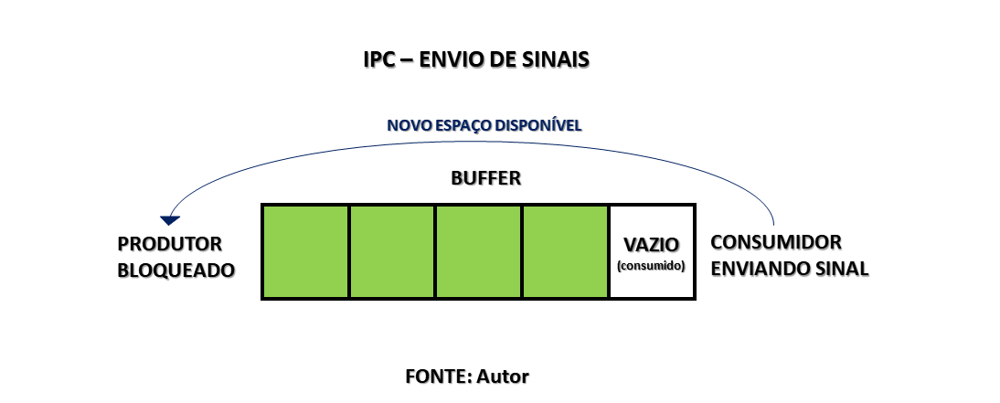

<h2 align = "center" >Aula 33  - Arquitetura - 08/11/2022 - Terça - Feira<h2>

<h3 align = "center" ><a href="https://github.com/ffborelli/curso-brq-java-2022-09-05/">Professor: Fabrizio Borelli</a></h3>

# Revisão

* Em rotas sempre temos que definir o from e o to, de onde vem para onde vai a nossa rota.
* O ponto forte do Camel, implementa varios templates de conectores de sistemas prontos , como por exemplo o que fizemos ontem de transferencia de arquivos.
* Possui varios padroes de projetos de integração de sistemas pre implementados.
* Criamos um projeto do zero
* adicionamos dependencias
* Banco de dados H2

# ESB

Um barramento de serviço corporativo ( ESB ) implementa um sistema de comunicação entre aplicativos de software que interagem mutuamente em uma arquitetura orientada a serviços (SOA). Ele representa uma arquitetura de software para computação distribuída e é uma variante especial do modelo cliente-servidor mais geral , em que qualquer aplicativo pode se comportar como servidor ou cliente. 
O grande problema desse serviço é congestionamento, ou um gargalo na comunição entre os serviços quando em alta demanda.
A ideia do micro serviço é acabar com esse barramento, tornando-os independentes e centralizados, com escalabilidade.

#PRODUTOR E CONSUMIDOR (BOUNDED BUFFER) - JAVA

O problema do produtor e consumidor, também referido como Bounded Buffer Problem (BBP), consiste em um desafio de sincronização de duas ou mais threads (tarefas) concorrentes que têm acesso a um mesmo recurso do programa que está sendo executado. O fato de o recurso estar sendo compartilhado, implica na possibilidade de conflitos entre as threads que disputam pelo controle da CPU para acessar esse mesmo recurso.

No caso do BBP, o recurso disputado é um buffer de memória (um vetor), de tamanho limitado/fixo, daí o motivo do nome. O produtor é o responsável por enfileirar novos jobs ou dados nesse buffer, e o consumidor assume a responsabilidade de extrair esses dados do buffer. Porém o seguinte problema poderá emergir: E se o produtor produzir muito rápido, e o consumidor não for capaz de acompanhá-lo?
Se isso acontecer, o produtor irá descartar todos os novos itens produzidos, até que haja espaço novamente no buffer, ou seja, dados serão perdidos. 

## INTERCOMUNICAÇÃO DE THREADS
Há uma solução para controlar o acesso ao Buffer, basta bloquearmos a execução do Produtor enquanto o buffer estiver cheio para reter a produção. O mesmo vale para o Consumidor, quando este se deparar com uma fila vazia deverá ser bloqueado para evitar ócio da CPU. Ambos os threads deverão ser despertados novamente assim que houver trabalho disponível - espaço na fila para o produtor e dados na fila para o consumidor - para ser processado.

Esta última consideração, nos leva a concluir que o Produtor precisará receber um sinal para ser acordado após ter sido bloqueado por falta de espaço no buffer, e este sinal terá que ser enviado pelo Consumidor que, após consumir um dado, liberará um novo espaço no buffer. De modo análogo, o Consumidor bloqueado por falta de dados no buffer, receberá um sinal do Produtor, após este último ter inserido um novo dado no buffer. Esse envio de sinais para controlar o acesso à uma região de memória, recebe o nome de Intercomunicação de Processos (IPC). Porém há ainda a possibilidade de o programa incorrer certas situações inesperadas.

## DEAD LOCKS
Quando a execução de um programa multi-thread envolve a comunicação entre threads, ou IPC, para controlar o uso de um recurso, chamamos esse recurso de região crítica do programa. Na nossa discussão, o ponto crítico é o buffer de memória. O uso do IPC para acessar regiões críticas deve ser feito com cautela, pois problemas de sincronização podem surgir, como os Dead Locks, que são becos sem saída em que um programa pode entrar. 

O Consumidor precisa bloquear ao se deparar com uma fila vazia - quantidade de elementos é zero - e aguardar um sinal do Produtor. Se o Consumidor inicia o teste da quantidade de elementos quando a fila está vazia mas perde o controle do programa antes de bloquear, o Produtor que agora assume o controle produz um novo dado no buffer antes vazio e envia um sinal para o Consumidor acordar. Se após o envio do sinal o controle for passado novamente para o Consumidor, este irá ignorar o sinal para despertar, pois ainda não está bloqueado, e irá retomar o bloqueio que havia antes iniciado após verificar que a quantidade de elementos era zero nas suas variáveis salvas durante a troca de contexto. Após o Consumidor ser bloqueado, o controle será passado novamente ao Produtor, que irá produzir o máximo de dados possíveis achando que o Consumidor foi desperto e por fim irá bloquear aguardando um sinal do Consumidor. Ambos ficarão bloqueados e o programa continuará executando em um Dead Lock, sem que qualquer tarefa seja executada. 

Isso acontece porque o Escalonador do sistema Operacional pode alocar o controle da CPU de uma forma inesperada. Para superar a barreira do Escalonador e evitar que Dead Locks ocorram, a operação de bloqueio deve ser atômica, ou seja, executada como se representasse uma única instrução para CPU, de modo que o Consumidor não perderá o controle da CPU no meio de um bloqueio, mas somente quando estiver totalmente bloqueado.

[EXEMPLIFICAÇÃO - ANIMAÇÃO](https://youtu.be/Q9CvjYnKcGQ)

## EXERCÍCIO DESAFIO:

Pegar os dados da loteria e gravar no H2