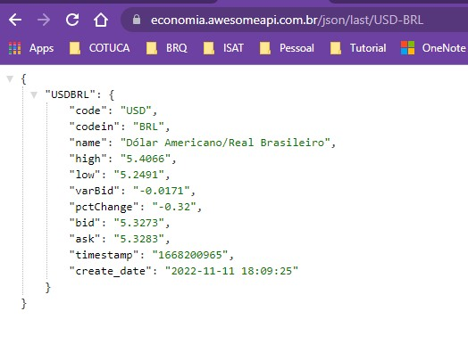
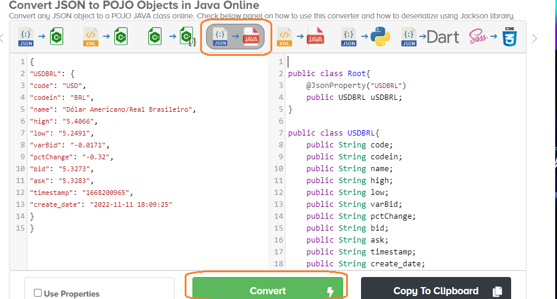
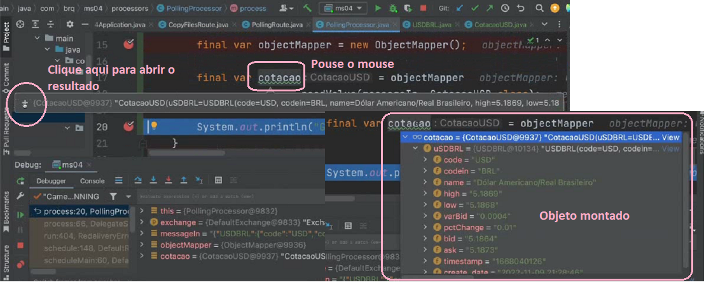

<h2 align = "center" >Aula 34  - Arquitetura - 09/11/2022 - Quarta - Feira<h2>

<h3 align = "center" ><a href="https://github.com/ffborelli/curso-brq-java-2022-09-05/">Professor: Fabrizio Borelli</a></h3>


# Revisão
- Processo de **PollingRoute**
- **Endpoint** é um canal através do qual o sistema pode receber ou enviar uma mensagem. Ele pode se referir a um URI de serviço da Web, URI de fila, arquivo, endereço de e-mail, etc.

- Variaveis de ambiente e variaveis do Spring
- **@Value:** anotação que permite injetar valores em campos **(variáveis JAVA)** dentro dos beans gerenciados pelo Spring **(@Component, @Service, @Repository, @RestController).**
- Payload: é basicamente o corpo da requisição
- Diferença entre **Endpoint**  e **API**
    - **Endpoint**: é um endereço mais um verbo HTTP, onde posso receber informações: Ex: localhost:8080/usuarios/
    - Um conjunto de **Endpoints** é relativo a uma **API**
    - **API** Mecanismo de padronização para expor nosso serviço

# Objetivo da Aula
- Seguir com o exemplo da aula anterior para consumir os dados da API de cotação do dólar.
- Conceito de Processor
    - **Processor** é uma interface Java que é usada para adicionar lógica de integração personalizada a uma rota. Ele contém um único método de processo usado para pré-formar a lógica de negócios personalizada em uma mensagem recebida por um consumidor.
    Seu objetivo é realizar transformações nas rotas de Camel.

### Converter uma String(json que foi convertido em texto) em Objeto  
1. Criar um novo pacote de nome **processors**
2. No pacote processors, vamos criar uma nova classe java de nome **PollingProcessor**
- <span style="font-family:Cascadia Code; font-size:1.5em;color: #BA55D3">Nesse ponto já podemos informar a classe **PollingRoute** qual processor ela irá utilizar.</span>

```diff
package com.brq.ms04.routes;
import com.brq.ms04.processors.PollingProcessor;
import lombok.extern.slf4j.Slf4j;
import org.apache.camel.builder.RouteBuilder;
import org.springframework.beans.factory.annotation.Value;
import org.springframework.stereotype.Component;


@Slf4j
@Component
public class PollingRoute extends RouteBuilder {

	@Value("${exchange.url}")
	private String url;

	@Override
	public void configure() throws Exception {

		log.info("O valor da URL é {}", url);

		from("timer:polling?period=5000")
				.to(url)
+				.process(new PollingProcessor())
				.log("${body}");
	}
}

```


3. Realizar o implements Processor 
4. Realizar a implementação do método process () ==> Lembrando que somos obrigados a implementar o método dado que a classe é interface.
5. Note que o método process(), recebe como parametro um objeto Exchange, que tem por definição:
    - **Exchange** é criado quando uma mensagem é recebida por um consumidor(Camel) durante o processo de roteamento. Este permite capturar dados da mensagem trocada entre a rota.
```

import org.apache.camel.Exchange;
import org.apache.camel.Processor;


public class PollingProcessor implements Processor {
    @Override
    public void process(Exchange exchange) throws Exception {
        }
   } 

```    
6. a mensagem que estamos trafegando é a String com os dados da cotação do dólar apresentado no Console. Vamos capturar a mensagem atraves do **Exchange**, e transforma-la conforme necessario.
    - A **mensagem** contém dados que serão transferidos para uma rota. Cada mensagem tem um identificador exclusivo e é construído a partir de um corpo, cabeçalhos e anexos.  
7. A Classe Exchange possui os métodos: 
    - **getIn()**, que captura a mensagem de entrada 
      - **getBody()** captura o corpo da mensagem de entrada.  
      - No parametro do getBody(), se passado vazio retorna um Object e nesse caso podemos forçar para pegar o tipo de dados que esperamos como retorno, nesse exemplo queremos o formato de String.class
      - Guardamos o nosso processamento em uma variavel de nome messageIn: String
      - Vamos rodar e ver o resultado

```

import org.apache.camel.Exchange;
import org.apache.camel.Processor;


public class PollingProcessor implements Processor {
    @Override
    public void process(Exchange exchange) throws Exception {
        final var messageIn = exchange.getIn().getBody(String.class);
        System.out.println("GET IN " + messageIn);

        
        }
   } 

```
#### Resultado exibido no Console

```
GET IN {"USDBRL":{"code":"USD","codein":"BRL","name":"Dólar Americano/Real Brasileiro","high":"5.4066","low":"5.2491","varBid":"-0.0029","

```
#### Converter / transformar json em classe / objeto java

1. Vamos pegar os dados tipo json da nossa API de cotação do dólar, colar no navegador e copiar o formato json.

2. Vamos colar o conteúdo copiado no item 1, no site de [conversão de arquivos json](https://json2csharp.com/code-converters/json-to-pojo), clicar no tipo de conversão de Json para Java.
    - Note que temos um objeto dentro do outro, o que indica que teremos que criar duas classes.

3. Vamos criar um novo pacote de nome **models**, e dentro dele a **classe principal(root)**, a qual daremos o nome de **CotacaoUSD.java** e a segunda classe que nomearemos de **USDBRL.java**
4. Na classe PollingProcessor, entendemos que nosso objetivo é **converter a String messageIn** em um objeto para isso:
    - Vamos instanciar o ObjectMapper
        - **final var objectMapper = new ObjectMapper();**
    - Vamos criar uma varivel do tipo ObjectMapper, que por parametros lê o conteúdo da String messageIn, e qual o modelo da classe que eu desejo usar para realizar a conversão.
        - **final var cotacao = objectMapper.readValue(messageIn, cotacaoUSD.class);**
    - Podemos validar em modo debug o resultado.
        - System.out.println("GET OUT " + cotacao);

   

### Concatenar informações com a mensagem

Vamos realizar uma alteração/processamento da mensagem captura antes de devolve-la ao front.
- Pegar o código antigo concatenei com -BRQ e setei no parametro
- Pegar o Exchange(mecanismo de troca de mensagens), pegar a mensagem e setar no body, passando como parametro a variavel cotacao, que contem o a mensagem convertida em objeto.

```diff
import com.brq.ms04.models.CotacaoUSD;
import com.fasterxml.jackson.databind.ObjectMapper;
import org.apache.camel.Exchange;
import org.apache.camel.Processor;

public class PollingProcessor implements Processor {
    @Override
    public void process(Exchange exchange) throws Exception {
        final var messageIn = exchange.getIn().getBody(String.class);
        System.out.println("GET IN " + messageIn);

        final var objectMapper = new ObjectMapper();

-         var cotacao = objectMapper
                        .readValue(messageIn, CotacaoUSD.class);
+         cotacao.getUSDBRL().setCode(cotacao.getUSDBRL().getCode()+ "- BRQ");
+         exchange.getIn().setBody(cotacao);
         
         
        System.out.println("GET OUT " + cotacao);
    }
}
```
#### Resultado da concatenação


