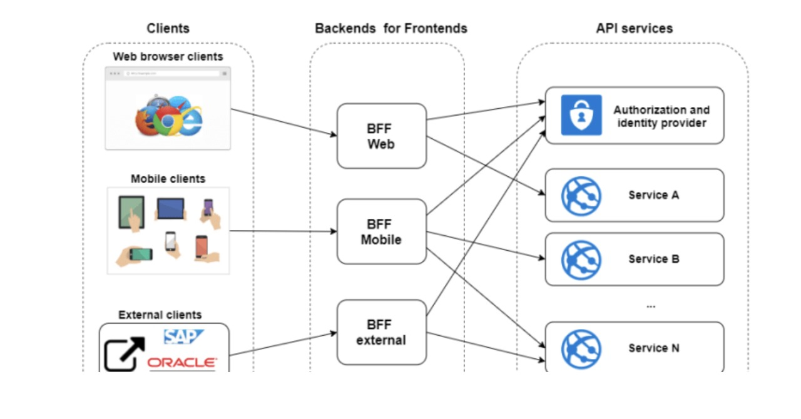

<h2 align = "center" >Aula 35  - Arquitetura - 10/11/2022 - Quinta - Feira<h2>

<h3 align = "center" ><a href="https://github.com/ffborelli/curso-brq-java-2022-09-05/">Professor: Fabrizio Borelli</a></h3>


# Revisão
- Processors: Pegamos e alteramos a estrura de uma mensagem.


## Arquitetura BFF

A arquitetura **Backend For Frontend (BFF)** é a chave para uma experiência de usuário aprimorada e aprimorada. Uma camada BFF consiste em vários back-ends desenvolvidos para atender às necessidades das respectivas estruturas de front-end, como desktop, navegador e aplicativos móveis nativos. Um dos maiores apelos do BFF é que ele garante uma interação perfeita do usuário, independentemente da plataforma em que o aplicativo front-end está sendo executado. Também aumenta a eficiência geral dos dispositivos inteligentes, pois os aplicativos desenvolvidos seguindo a arquitetura **BFF** otimizam o uso de recursos enquanto o aplicativo está em uso. No BFF, existem APIs para usos específicos; reduzindo significativamente a área de superfície que precisa ser protegida enquanto aumenta muito a confiança do usuário.

## PERGUNTA: Como podemos guardar os dados provinientes da API no BD H2, utilizando Camel?

0. Configurar BD H2 - Fazer uma alteração
1. Criar mapeamento entre as tabelas do BD e as classes Java (camada Model)
2. Criar repository
3. Criar Serviço ==> Criar a classe Bean

Vamos criar uma camada para realizar a conversão e outra camada para realizar o mapeamento do Banco.
- Alteramos as classes criadas anteriormente na camada de Model para a camada DTO;
- Criamos uma nova classe na camada **Model: USDBRLModel**, onde vamos realizar o mapeamento para o BD e criar a tabela de forma automatica via instrução no arquivo applicationproperties
- Lê a classe Model e cria as tabelas no BD automaticamente.
    - spring.jpa.hibernate.ddl-auto=create

```diff
import lombok.AllArgsConstructor;
import lombok.Data;
import lombok.NoArgsConstructor;

+import javax.persistence.*;

@Data
@AllArgsConstructor
@NoArgsConstructor
+@Entity
+@Table(name= "cotacao_usd")
public class USDBRLModel {

+    @Id
+    @GeneratedValue(strategy = GenerationType.IDENTITY)
+    private Integer id;
    private String code;
    private String codein;
    private String name;
    private String high;
    private String low;
    private String varBid;
    private String pctChange;
    private String bid;
    private String ask;
    private String timestamp;
    private String create_date;
}

```
### Resultado via console ao rodar a aplicação 

```
Hibernate: 
    
    drop table if exists cotacao_usd CASCADE 
Hibernate: 
    
    create table cotacao_usd (
       id integer generated by default as identity,
        ask varchar(255),
        bid varchar(255),
        code varchar(255),
        codein varchar(255),
        create_date varchar(255),
        high varchar(255),
        low varchar(255),
        name varchar(255),
        pct_change varchar(255),
        timestamp varchar(255),
        var_bid varchar(255),
        primary key (id)
    )

```
- Criar a camada de repository e dentro a interface USDBRLRepository
```
import com.brq.ms04.models.USDBRLModel;
import org.springframework.data.jpa.repository.JpaRepository;
import org.springframework.stereotype.Repository;

@Repository
public interface USDBRLRepository extends JpaRepository<USDBRLModel, Integer> {
}

```
Spring ApplicationContext é onde Spring mantém instâncias de objetos que ele identificou para serem gerenciados e distribuídos automaticamente. Estes são chamados de **BEANS (@Beans)**.
O bean é algo que poderá ser reutilizado pelo Camel, este objeto contém métodos que podemos chamar. Neste caso, será um metodo para salvar dados no BD. Possui o mesmo conceito da camada Service.

- Criar um novo pacote de nome beans
- Criar a classe USDBRLBean
- Na Classe criar o método save(), do tipo  USDBRLModel que receberá como parametro a mensagem no formato de String, converter em objeto e salvar no BD.


