<h2 align = "center" >Aula 36  - Arquitetura - 10/11/2022 - Sexta - Feira<h2>

<h3 align = "center" ><a href="https://github.com/ffborelli/curso-brq-java-2022-09-05/">Professor: Fabrizio Borelli</a></h3>


# Revisão


# Objetivo da Aula

1 - Ativar o containner activemq
2 - Trabalhar com filas MQ


## Fila MQ

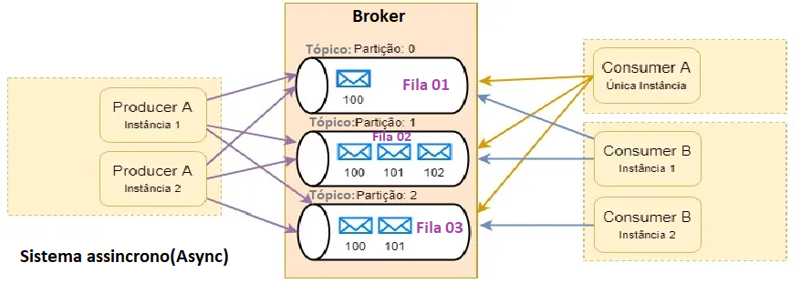

Uma fila é um contêiner para mensagens. Os aplicativo de negócios conectados ao gerenciador de filas que hospeda a fila podem recuperar mensagens da fila ou podem gravar mensagens na fila. Uma fila possui uma capacidade limitada em termos do número máximo de mensagens que ela pode manter e o comprimento máximo dessas mensagens.

É um serviço de mensageria,conectando dois sitemas enviando mensagem do sistema A para o sistema B.
É um sistema **assincrono**, ou seja, não existe um encadeamento de eventos, não há dependencias entre quem envia e o retorno.
Usadas para processamento de dados em tempo real, em alto volume de dados.
**Paradigma produtor / consumidor:** onde uma entidade é responsavel por enviar a mensagem e a outra entidade é responsavel por receber a mensagem.
O produtor, envia para um intermediario, e quem recebe a mensagem consulta o intermédiario chamado de **Broker**.
**Consumidores**, são entidades que ficam ouvindo alterações no **Broker**, e quando ocorrer alguma alteração, será capturada e processada.
As mensagem ficam armazenas no **Broker**, até ser consumida por algum consumidor.
Um **Broker**, possui uma estrutura chamada de **tópicos**, que são canais que podemos enviar ou sobrescrever para receber mensagem, ou seja são estruturas que servem para melhor organizar as informações.
Cada **tópicos**, simboliza um padrão ou tipo de mensagem.

## O Papel do Broker

Brokers (Message ou Streams) são utilizados para intermediar a comunicação entre os microsserviços, os quais não possuem contato direto, por meio de roteamento de mensagens. O Message Broker Design Pattern não abrange conceitualmente modelos transacionais, deixando a cargo de Frameworks que implementam determinadas funcionalidades presentes em um Broker a decisão de ser naturalmente transacional ou não lidar com transações de maneira padrão.

## Criar containner MQ

1. Rodar no console com o docker startado:
    - docker run --name activemq -p 61616:61616 -p 8161:8161 rmohr/activemq

## Interface Gráfica

- Acessar **COM** user e senha  [ActiveMQ](http://localhost:8161/)
-  Acessar **SEM** user e senha  [ActiveMQ](http://localhost:8161/admin)
    - Em caso de erro de porta ocupada:
        - Abra o powerShel como adm
        - Rode os comandos:
            - net stop winnat
            - docker rm
            - docker rm activemq
            - docker run --name activemq -p 61616:61616 -p 8161:8161 rmohr/activemq
            
         - Em outra instancia do powerShel como adm rode:
            -  net start winnat  
- Realizar o login:
    - Usuario e senha : admin
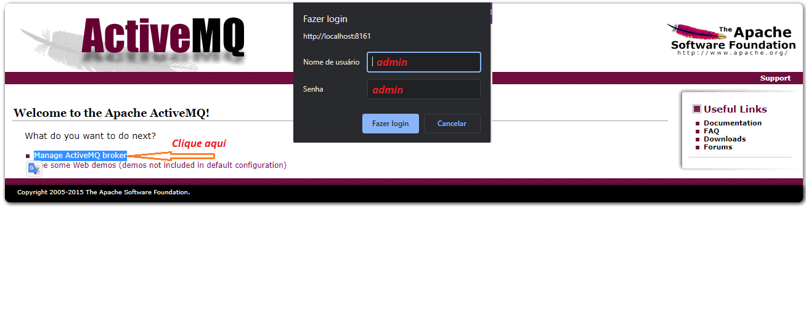   
    Logado:
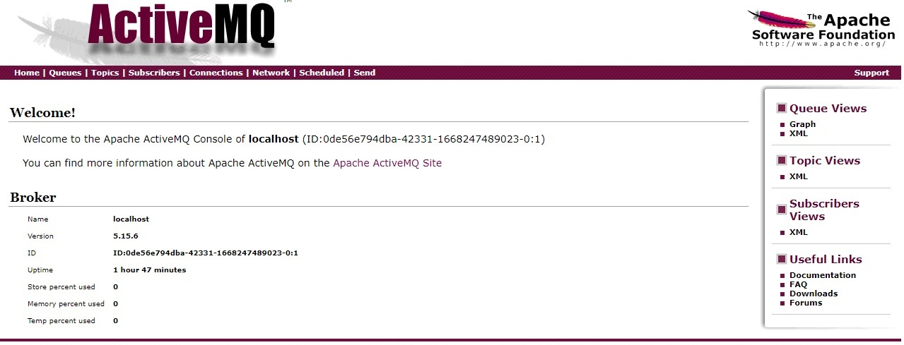        

## Papel de produtor

- Enviar mensagem para a uma determinada fila.
    - **Lembrando**, a fila MQ está rodando em nosso containner de fila MQ, que possui duas portas ativas? **8161**( padrão da interface gráfica) e **61616**(onde se envia ou se consome a mensagem), que foram informadas no momento em que criamos o nosso containner:
        - **docker run --name activemq -p 61616:61616 -p 8161:8161 rmohr/activemq**
    - Clicar no menu **Send**  

   


## Parametrizando para usar a fila MQ

- Adicionar uma nova dependencia ao arquivo: **pom.xml**
- **Lembre-se** de resolver(reload) a nova dependencia no Maven.

```
<dependency>
    <groupId>org.apache.camel.springboot</groupId>
	<artifactId>camel-activemq-starter</artifactId>
	<version>3.5.0</version>
</dependency>

```
<span style="font-family:Cascadia Code; font-size:1.5em;color: #BA55D3">DICA: </span> Notamos que as versões informadas nas dependencias do Camel no arquivo pom.xml, é algo bem repetitivo, assim podemos realizar uma refatoração do arquivo, tornando-o parametrizavel:

- Criar uma propriedade para armazenar a versão do Camel
```diff
<properties>
    <java.version>11</java.version>
+    <camel.version>3.5.8</camel.version>
+    <objectmapper.version>2.3.5</objectmapper.version>
</properties>

```
- Substituir a Version informada em cada dependencia

```diff
 <!-- Apache Camel v3.5 -->
<dependency>
    <groupId>org.apache.camel.springboot</groupId>
    <artifactId>camel-spring-boot-starter</artifactId>
-    <version>3.5.0</version>
+    <version>${camel.version}</version>

</dependency>

<dependency>
    <groupId>org.modelmapper</groupId>
    <artifactId>modelmapper</artifactId>
-    <objectmapper.version>2.3.5</objectmapper.version>
+    <version>${objectmapper.version}</version>
</dependency>

```
- <span style="font-family:Cascadia Code; font-size:1.5em;color: #FF4500">Lembre de resolver as depêndencias do Maven(reload) </span>

## Rota para produzir mensagem para o ActiveMQ

- Criar a classe ActiveMQProducerRoute;
- Extends a classe RouteBuilder;
- Implementar o método configure();
- No método, vamos implementar nossa lógica para produzir uma mensagem.
    - Ponto de partida: 
        - **Rota do tipo:** timer
        - **Nome da rota:** active-mq-producer
        - **?:** Passagem de parametro: period=5000
        - Neste momento, para evitar que o destino chegue como null, acrescentamos o metodo transforme de uma mensagem constante.
        - Envio a msg contante para a fila activemq com o nome do tópico criado na interface gráfica: **.to("activemq:meu-primeiro-topico")**

```
import org.apache.camel.builder.RouteBuilder;

public class ActiveMQProducerRoute extends RouteBuilder {


	@Override
	public void configure() throws Exception {
		from("timer:active-mq-producer?period=5000")
			.transform().constant("Apache Camel")
            .log("${body}")
		    .to("activemq:meu-primeiro-topico");

	}
}

```

- Precisamos informar qual o endereço da fila, para isso vamos inserir uma propriedade no arquivo application.properties.
    - O endereço é localhost
    - O protocolo é tcp
    - A porta é a da interface gráfica, configurada no docker.
    - O log, para visualizarmos que a msg está sendo enviada via Console.

```
spring.activemq.broker-url=tcp://localhost:61616

```
- Rodar a aplicação
- Confirmar na interface gráfica o envio das mensagens.
<span style="font-family:Papyrus; font-size:1.2em;color: #FF4500">Não conseguimos realizar a simulação do envio de msgs a fila MQ, assim alteramos o código, o nome do tópico foi gerado automaticamente pelo código, e a consulta realizada na fila "**Queues**"</span>

```diff

import org.apache.camel.Exchange;
import org.apache.camel.Processor;
import org.apache.camel.builder.RouteBuilder;
import org.springframework.stereotype.Component;

import java.util.Random;

@Component
public class ActiveMQProducerRoute extends RouteBuilder {

@Override
public void configure() throws Exception {

	from("timer:active-mq-producer?period=5000")
		//.transform().constant("Apache Camel")
		.process(new Processor() {
		
        @Override
		public void process(Exchange exchange) throws Exception {
		Random random = new Random();
		exchange.getIn().setBody("Apache Camel " + random.nextInt());
			}
		})
			.log("${body}")
			.to("activemq:meu-primeiro-topico-2");
	}
}


```
## Resultado do envio das mensagens via Interface e Console

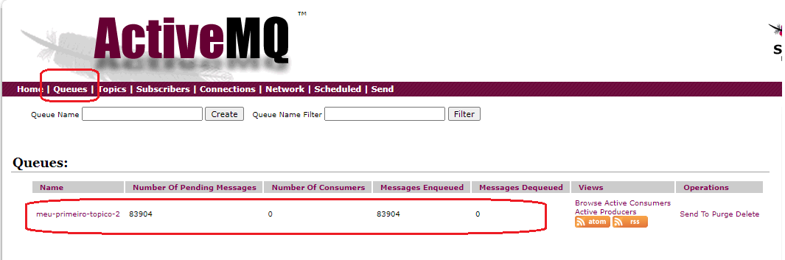
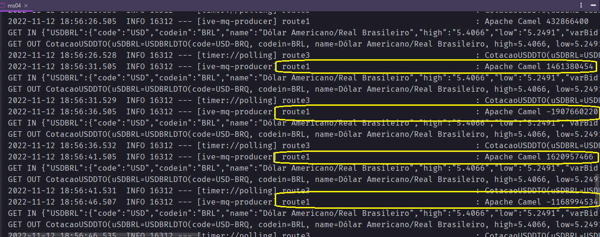


## Rota para consumir mensagem para o ActiveMQ

- Neste primeiro momento, estamos realizando a criação e o consumo da mensagens partindo do mesmo micro-serviço, não necessariamente deve ser dessa forma.
- Então apenas informamos a origem do consumo, sem destino, seria essa a diferença em código.

```
import org.apache.camel.builder.RouteBuilder;

public class ActiveMQConsumerRoute extends RouteBuilder {
	@Override
	public void configure() throws Exception {
		
		from("activemq:meu-primeiro-topico-2")
				.log("LOG CONSUMER >>>>>>> ${body}");
	}
}

```
## Resultado do consumo

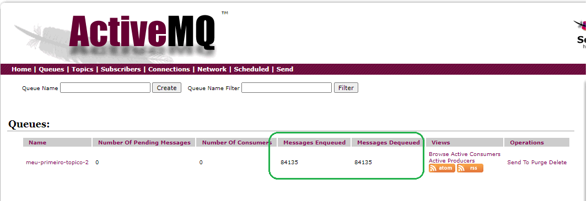

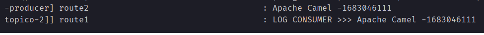

## Envio e Consumo do mesmo endereço para diversas máquinas

-Acessar a interface gráfica externa: 
    - http://ffborelli.ddns.net:8161/
    - Login e senha: **admin**

- No arquivo application.properties, vamos realizar a alteração da origem / destino

```diff
-#spring.activemq.broker-url=tcp://localhost:61616

+spring.activemq.broker-url=tcp://ffborelli.ddns.net:61616

```
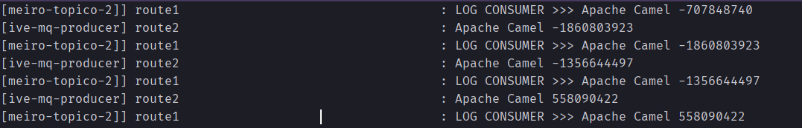
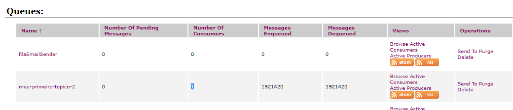

## Guardar as mensagens consumidas em BD

Classes a serem criadas:

1. MessageInModel
2. MessageInRepository
3. MessageInBean
4. ActiveMQConsumerRoute

- Criar uma nova Model para gerar uma nova tabela no BD
- Na Classe consumer, podemos fazer um **Bean**(Como se fosse a Service), onde a mensagem consumida será armazenada e salva
- Nova classe da Model: MessageInModel

```

import lombok.AllArgsConstructor;
import lombok.Builder;
import lombok.Data;
import lombok.NoArgsConstructor;

import javax.persistence.*;

@Builder
@Data
@AllArgsConstructor
@NoArgsConstructor
@Entity
@Table(name = "message_in")
public class MessageInModel {

    @Id
    @GeneratedValue(strategy = GenerationType.IDENTITY)
    private Integer id;
    private String message;
}

```
- Criar uma interface na  repository de nome: MessageInRepository

```
import com.brq.ms04.models.MessageInModel;
import org.springframework.data.jpa.repository.JpaRepository;
import org.springframework.stereotype.Repository;

@Repository
public interface MessageInRepository
        extends JpaRepository<MessageInModel, Integer> {
}

```
- No repositório Beans, vamos criar uma nova classe: MessageInRepository

```
import com.brq.ms04.models.MessageInModel;
import com.brq.ms04.repositories.MessageInRepository;
import org.springframework.beans.factory.annotation.Autowired;
import org.springframework.stereotype.Component;

@Component
public class MessageInBean {

    @Autowired
    private MessageInRepository repository;

    public MessageInModel save(String message){

        final var m = MessageInModel
                              .builder()
                              .message(message)
                              .build();

        return repository.save(m);
    }
}

```
- Na classe consumer, vamos chamar o Bean
- Ao rodar, vamos perceber muiiitos inserts de mensagens
```

import com.brq.ms04.beans.MessageInBean;
import org.apache.camel.builder.RouteBuilder;
import org.springframework.stereotype.Component;

@Component
public class ActiveMQConsumerRoute extends RouteBuilder {

	@Override
	public void configure() throws Exception {

		from("activemq:meu-primeiro-topico-2")
				.bean(MessageInBean.class, "save")
				.log("LOG CONSUMER >>> ${body}");
	}
}

```
## Resultados

### Criação de tabela e insert no BD - H2
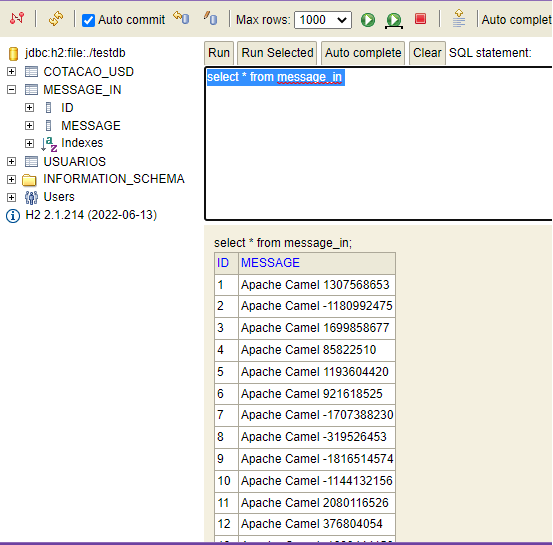

### Criação de tabela e insert no BD - Console

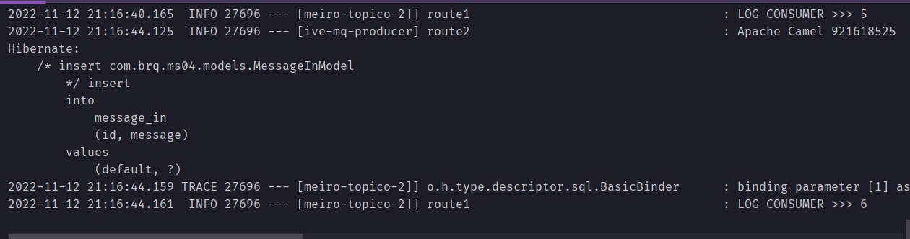
