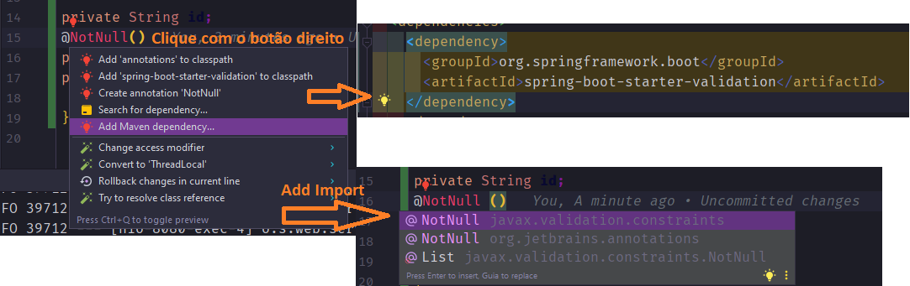

<h2 align = "center" >Aula 39  - Camel - 16/11/2022 - Quarta - Feira<h2>

<h3 align = "center" ><a href="https://github.com/ffborelli/curso-brq-java-2022-09-05/">Professor: Fabrizio Borelli</a></h3>

# Lição de CASA: spring mongo

- Criar o novo microserviço: com.brq.ms05.**Ms05**Application

1. Fazer crud completo de usuários
2. Usar response entity
3. Criar DTOs
4. Criar validação de campos nos DTOs
5. Criar interface de services
6. Criar testes unitários

## Revisão com dúvidas da lição de casa

### Fluxo "normal" de desenvolvimento

1. Criar a camada de **model** (mapear o banco de dados em classes JAVA) 
2. Criar a camada de **repository** (camada de acesso ao banco de dados) 
3. Criar a camada de **serviços** 
4. Criar os **controllers** e os **DTOS**, junto com a validação de dados. 
5. Criar **testes unitários**

## Algumas dependências:

- Para **validação**, podemos utilizar a :
    - org.springframework.boot spring-boot-starter-validation
- Para **converter objetos**(DTO -> Model e Model -> DTO), podemos usar a:
    - org.modelmapper modelmapper 2.4.4
- Para usar o **JPA** (especificação) 
- Para usar o **Hibernate** (implementa a especificação)
    - org.springframework.boot spring-boot-starter-data-jpa
- Para usar o **Swagger**:
    - io.springfox springfox-swagger2 2.9.2 io.springfox springfox-swagger-ui 2.9.2
- Para usar o driver do **banco** de dados **relacional**:
    - mysql mysql-connector-java runtime org.postgresql postgresql 42.5.0
- Para criar o **relatório dos testes unitários** e enviar para o SonarQube (ferramenta de qualidade de código)
     - org.jacoco jacoco-maven-plugin 0.8.6
- Dependência para **ActiveMQ** para Spring
    - org.springframework.boot spring-boot-starter-activemq 2.7.5
## DTO
Data Transfer Object (DTO) ou simplesmente Transfer Object é um padrão de projetos bastante usado em Java para o transporte de dados entre diferentes componentes de um sistema, diferentes instâncias ou processos de um sistema distribuído ou diferentes sistemas via serialização.

### Validação de dados na camada controller
Colocamos anotações sobre os atributos da classe DTO
- Para **validação**, podemos utilizar a :
    - org.springframework.boot spring-boot-starter-validation
```
<dependency>
	<groupId>org.springframework.boot</groupId>
	<artifactId>spring-boot-starter-validation</artifactId>
</dependency>

```

- Para **converter objetos**(DTO -> Model e Model -> DTO), podemos usar a:
    - org.modelmapper modelmapper 2.4.4

- **@NotNull:** campo não pode ser nulo
- **@NotEmpty:** não pode ser vazio  


## Fluxo "normal" de usar/testar a aplicação

1. Partir do Postman (ou outro client de REST) com o verbo e endpoint correto


- Sai do **BD** e vai para **Model**
- Da **Model** para a **Repository**
- Da **Repository** vai para a **Service**
- Da **Service** vai para a **Controller**
    - **NÃO** é uma boa prática retornar **Model** na **Controller**, temos que retornar **DTO**
    - Sempre que retornar algo da controller precisar usar o ResponseEntity, pois contem informações da requisição como status, metadados que facilitam quem está chamando o nosso serviço

# @Component

Antes de podermos entender o valor de **@Component**, primeiro precisamos entender um pouco sobre o Spring ApplicationContext.

Spring ApplicationContext é onde Spring mantém instâncias de objetos que ele identificou para serem gerenciados e distribuídos automaticamente. Estes são chamados de **BEANS** (@Beans).

O gerenciamento do bean e a injeção de dependência são alguns dos principais recursos do Spring.

Usando o princípio de Inversão de Controle, o Spring coleta as instâncias do bean de nosso aplicativo e os usam no momento apropriado. Podemos mostrar as dependências dos bean para Spring sem precisar lidar com a configuração e instanciação desses objetos.

A capacidade de usar anotações como **@Autowired** para injetar beans gerenciados pelo Spring em nosso aplicativo é uma força motriz para a criação do nosso código no Spring.


- @Component

@Component é uma anotação que permite o Spring detectar automaticamente nossos beans personalizados.

Em outras palavras, sem ter que escrever nenhum código explícito, o Spring irá:

- Examinar nosso aplicativo para classes anotadas com @Component
- Instanciar e injetae quaisquer dependências especificadas neles (com classes dos objetos @Component)
- Injetar os objetos na nossa aplicação sempre que necessário


# FAQs

* Qual o papel do **POM**? 
    * Resposta: quando utilizamos o gerenciador de dependências **MAVEN**, temos que colocar todas as dependências (bibliotecas) no arquivo pom.xml, que está na raiz do projeto.

