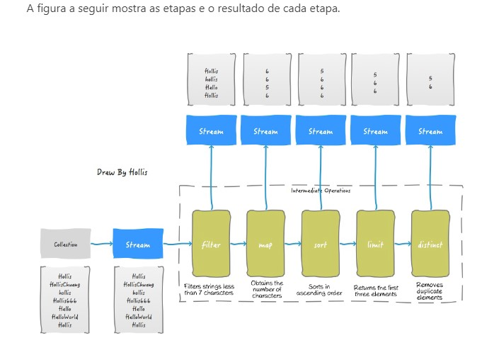
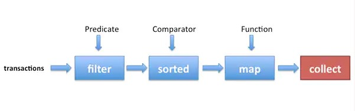
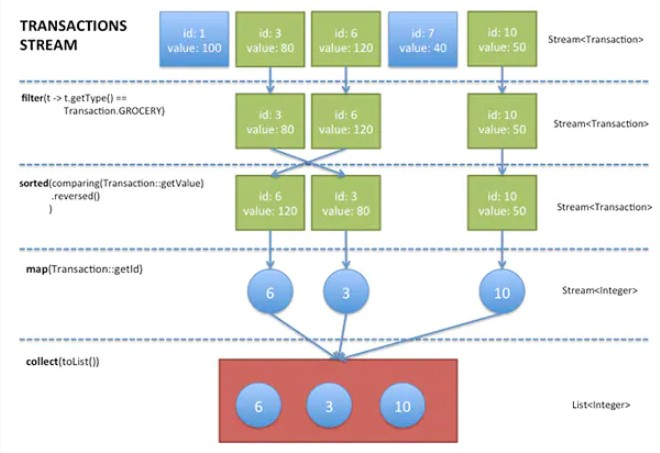
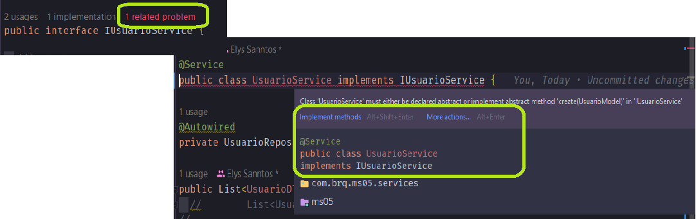
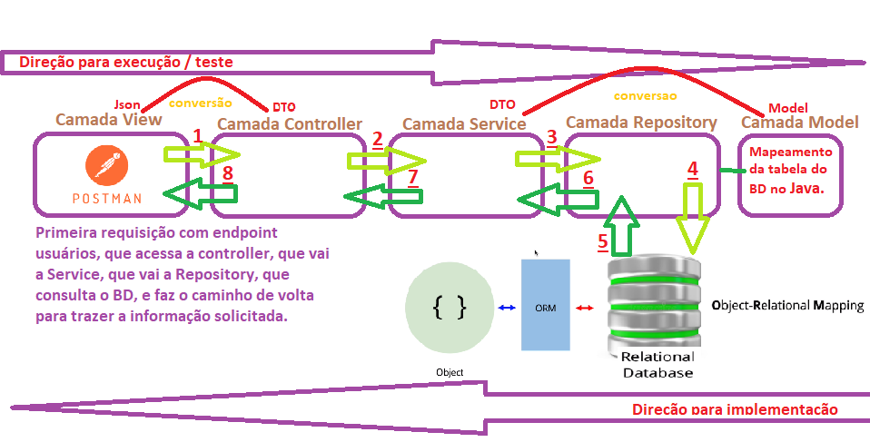
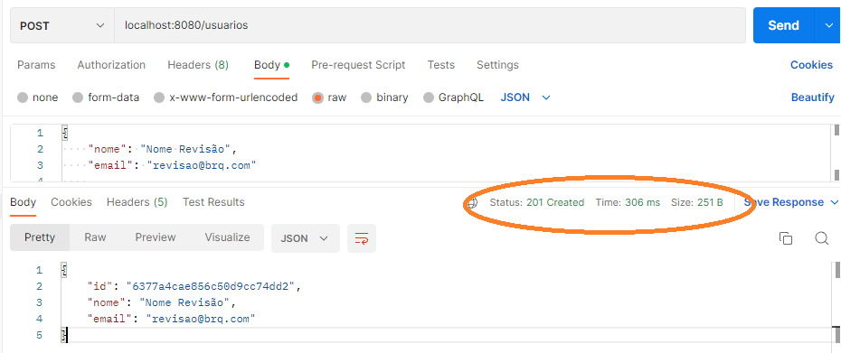

<h2 align = "center" >Aula 40  - Camel - 17/11/2022 - Quinta - Feira<h2>

<h3 align = "center" ><a href="https://github.com/ffborelli/curso-brq-java-2022-09-05/">Professor: Fabrizio Borelli</a></h3>

# Revisão com Exercicio

- Camada model com Mongo - decorator @Document
- Camada service - GetAll
- Camada Controller - GetAll

# Revisão com Exercicio - continuação

## [Processamento de dados com streams do Java](https://www.oracle.com/br/technical-resources/articles/java/processing-streams-java-se-8.html)



A abstração chamada **Stream**,  permite processar dados de forma declarativa, permitindo aproveitar as arquiteturas de núcleos múltiplos sem ter que programar linhas de código multiprocesso. 
Stream é um fluxo continuo - processamento em tempo real.

**Stream no Java:** Basicamente temos uma lista e podemos transformar em um fluxo continuo, tratando cada item da lista individualmente.

Uma forma simples de converter uma lista de Model para uma lista de DTOs.
Por ser mais performatico é recomendado o uso da API stream, a um for / forEach normal.


```

/*
stream é mais performático -

converter List<Model> para List<DTO>
*/
  return repository.findAll ()
    .stream ()
    .map (x->x.toDTO ())
    .collect (Collectors
    .toList ());
}

```



<span style="font-family:DejaVu Sans Mono; font-size:1em;color: #A020F0">Em primeiro lugar, obtemos uma stream da lista de transações (dados) com o método stream() disponível para List. Em seguida, várias operações (filter, sorted, map, collect) são encadeadas em um ///processo, que pode se ver como uma consulta dos dados.</span>

**Programação com streams:** primeiros passos Vamos começar com um pouco de teoria. Qual a definição de stream? 

De forma sucinta, podemos dizer que é uma "sequência de elementos de uma fonte de dados que suporta operações de agregação". Vamos dividir a definição:  

**Sequência de elementos:** Uma stream oferece uma interface para um conjunto de valores sequenciais de um tipo de elemento particular. Apesar disso, as streams não armazenam elementos; estes são calculados sob demanda.

**Fonte de dados:** As streams tomam seu insumo de uma fonte de dados, como coleções, matrizes ou recursos de E/S.

**Operações de agregação:** As streams suportam operações do tipo SQL e operações comuns à maioria das linguagens de programação funcionais, como filter, map, reduce, find, match e sorted, entre outras. 
Ainda mais, as operações das streams têm duas características fundamentais que as diferenciam das operações com coleções:

**Estrutura de processo:** Muitas operações de stream retornam outra stream. Assim, é possível encadear operações para formar um processo mais abrangente. Isto, por sua vez, permite algumas otimizações, por exemplo mediante as noções de "preguiça" (laziness) e "corte de circuitos" (short-circuiting), que analisaremos mais a frente.
Iteração interna: Diferentemente do trabalho com coleções, em que a iteração é explícita (iteração externa), as operações da stream realizam uma iteração por trás dos bastidores. 



### Qual é a diferença de um array  e um arrayList ??

**Array** tem um tamanho fixo, desde que o objeto é criado, e esse tamanho é imutável.
Um array é um vetor de objetos ou tipos primitivos, possui um tamanho fixo informado no momento em que é inicializado.

```

String[] array = new String[3];

```

Essa array de String **SEMPRE** vai ter 3 posições, independente de se todas estão ocupadas ou não. E sempre no máximo 3 itens dentro dela. 

**ArrayList** não, ela tem o tamanho exato de quantos componentes ela tiver. Quando ela é criada
Um ArrayList é uma implementação da interface List, outra implementação desta interface é o LinkedList. Como o nome sugere, são implementações de um tipo de dado conhecido como Lista. A memória é alocada dinamicamente, sob demanda. 
```
ArrayList arrayList = new ArrayList();`

```

Tem zero posições. a medida em que itens são adcionados, ela cresce, ou diminui ao se retirar itens, com os métodos add() e remove()


## [Interface](https://sites.google.com/site/anhangueraniteroipoo/aulas/aula-4---interfaces)

**INTERFACES** - Classes com comportamentos semelhantes

Interfaces são um conceito da programação orientada a objetos que tem a ver com o comportamento esperado para uma ou um conjunto de classes.

Interfaces definem o que uma classe deve fazer e não como. Assim, interfaces não possuem a implementação de métodos pois apenas declaram o conjunto de métodos, o comportamento que uma ou um conjunto de classes deve ter. 

Na interface, todos os métodos são portanto **abstratos** e **públicos**, já que são apenas declarados na interface sendo obrigatoriamente implementados pelas classes que implementam a interface.

Uma vez definida uma interface é implementada pelas classes de devem ter o comportamento descrito na interface, ou seja, devem ter os mesmos métodos definidos na interface. Dizemos que as classes implementam a interface pois de fato uma classe ao implementar uma interface deve prover a implementação de todos os métodos definidos na interface.

Assim como as **classes abstratas as interfaces não podem ser instanciadas**, ou seja, não podemos criar um objeto de uma interface.

Pode-se dizer que uma interface estabelece um contrato a ser seguido por um conjunto de classes. Este contrato pode ser entendido com a declaração do comportamento de um conjunto de classes.

As Interfaces possuem somente  a declaração dos métodos, ou seja, o tipo de retorno, o nome do método, seus parâmetros e as exceções lançadas pelo método.  A implementação dos métodos será feita pelas classes que implementam a interface. 

**Contrato de Comportamento**

Assim uma classe que implementa uma interface deve **obrigatoriamente** implementar todos os métodos declarados na interface. Em outras palavras, a classe deve seguir o contrato de comportamento definido na interface. Uma interface estabelece um contrato de comportamento para um conjunto de classes.

A principal diferença entre uma interface e uma classe abstrata é uma classe pode herdar apenas uma classe abstrata mas pode implementar mais de uma interface.


- No caso da criação do CRUD de nossa interface:
    1. Criamos o contrato na Interface
        - Declaramos que o metodo criate vai retornar um Usuario DTO e recebe no parametro um Usuario Model.

        ```
        UsuarioDTO create(UsuarioModel model);

       ```  
    2. Precisamos implementar na classe Usuario Service o contrato.
     


# MVC

Na parte de **contrução** de uma aplicação, é recomendado o pensamento de tras para frente:
* Model ==> Repository ==> Service ==> Controller 

Na parte de **execução**, iniciamos da camada View para chamar a controller

  


# Status code
<span style="font-family:Papyrus; font-size:1.2em;color: #FF4500">IMPORTANTE:</span>
Uma boa prática é retornar o status $\textcolor{#008000}{201}$  quando cria-se um novo objeto via API

  


# CRUD com Interface

- **@RequestMapping**(value = "${endpointDoDanilo}")
  - Faz com que o prefixo da url, fique fixo para todas as rotas.
  Quando for preciso buscar por Id, devemos adicionar o value ao verbo, como é o caso dos verbos patch e delete.
  ```
  @PatchMapping (value = "{id}")

  @DeleteMapping(value = "{id}")

  ```
