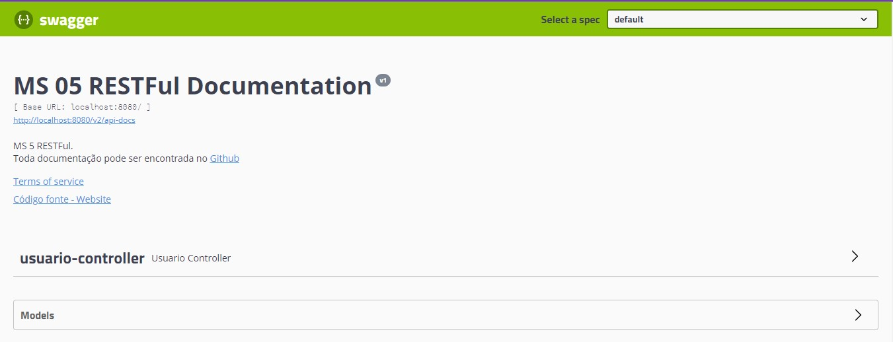

<h2 align = "center" >Aula 42  - Camel - 19/11/2022 - Sábado <h2>

<h3 align = "center" ><a href="https://github.com/ffborelli/curso-brq-java-2022-09-05/">Professor: Fabrizio Borelli</a></h3>


# Swagger

## O que é SWAGGER?

Swagger é um framework opensource composto por diversas ferramentas, que auxilia o desenvolvedor na descrição, no consumo e na visualização de uma API REST,no entanto para realizar tais tarefas o Swagger se utiliza de uma especificação chamada OPENAPI que define um padrão padronizado de uma requisição JSON.
Como já dissemos anteriormete o swagger é composto por diversas ferramentas mas as principais são:

[*Swagger Editor*](https://editor.swagger.io/) - sua função principal é ajudar o desenvolvedor a definir uma estrutura de uma API no inicio de um projeto

**Swagger Codegen** - sua função principal é criar todo o “esqueleto” da API a partir de uma descrição em YAML.

**Swagger UI** - sua função principal é criar uma documentação elegante,por meio de uma interface gráfica, onde usuários podem descrever suas APIs e realizar testes nas mesmas sem que haja qualquer tipo de dano aplicação em ambiente de produção.

Neste artigo vamos mostrar como integrar uma aplicação java utilizando o Swagger UI.

Adicionando a Lib SpringFox numa API com Spring Boot

Com a aplicação criada e com os endpoints funcionando,adicione no pom.xml essas duas dependências:

```

    <!--dependência do swagger-->
    <dependency>
      <groupId>io.springfox</groupId>
      <artifactId>springfox-swagger2</artifactId>
      <version>2.9.2</version>
    </dependency>

    <!--dependência do swagger-->
    <dependency>
      <groupId>io.springfox</groupId>
      <artifactId>springfox-swagger-ui</artifactId>
      <version>2.9.2</version>
    </dependency>

```

Com as dependências recém colocadas na aplicação chegou a hora de habilitar o swagger, para isto, vamos criar um novo pacote (configs), com a classe java: SwaggerConfig.

```
package com.brq.ms05.configs;


    @Bean
    public Docket swaggerSpringView() {
        return new Docket(DocumentationType.SWAGGER_2).select()
                       .apis(RequestHandlerSelectors.basePackage("com.brq.ms05")).paths(PathSelectors.any()).build()
                       .apiInfo(metaData()).produces(DEFAULT_PRODUCES_AND_CONSUMES).consumes(DEFAULT_PRODUCES_AND_CONSUMES);
    }

private ApiInfo metaData() {
        return new ApiInfoBuilder ().title("MS 05 RESTFul Documentation").description("MS 5 RESTFul."
                                                                                               + "<br>Toda documentação pode ser encontrada no [Github](https://github.com/ElysSanntos/Aprendizado---Bootcamps/tree/master/GRANDE_PORTE/Java%20MF%20-%20BRQ%20-%20SET22/Postman)")
                       .version("v1")
                       .termsOfServiceUrl(
                               "https://github.com/ElysSanntos/")
                       .contact(new Contact("Código fonte",
                               "https://github.com/ElysSanntos", null))
                       .build();
    }    

   


```
Neste método estamos definindo que nosso **bean** que chamamos de *Docket* terá acesso a todos os endpoints da aplicação, além disso criamos um método privado que retorna um objeto do tipo **ApiInfo**
que tem como objetivo criar informações customizadas acerca dos nossos endpoints.Com isso através de reflection a lib já consegue obter os endpoints que estão disponíveis na aplicação.

Para acessar o Swagger UI é necessário digitar(http://localhost:8080/swagger-ui.html) o resultado será semelhante ao da figura abaixo:



### Personalizando Mensagens Globais:

Caso você precise personalizar todos os códigos de retorno que um endpoint retorne você precisará utilizar dentro do nosso bean Docket o método **globalMessage** recebendo como parâmetro um método http e uma lista de ResponseMessage. 

### Utilizando Autenticação no Swagger

Caso sua aplicação utilize algum tipo de autenticação é necessário configurarmos no **SpringFox**, para isto utilizamos dois métodos o **securityContext** e **SecurityScheme**. No primeiro método defino o tipo de autenticação( se é ApiKey,BasichAuth,OAuth) e o segundo defino particularidades da autenticação.

No exemplo abaixo definimos uma autenticação do tipo ApiKey dentro do nosso bean Docket e definimos que o endpoint pedido deverá ter uma autenticação:

## Enum


## Redis
docker run --name redis-commander -d --env REDIS_HOSTS=redis -p 8081:8081 rediscommander/redis-commander:latest