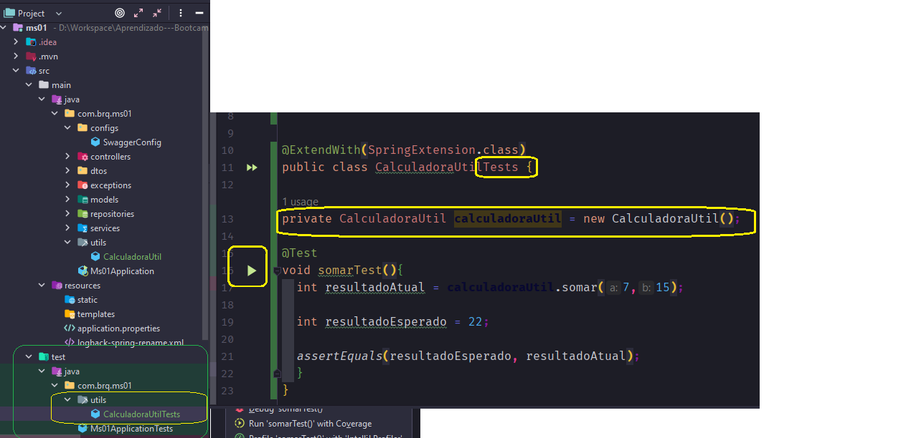
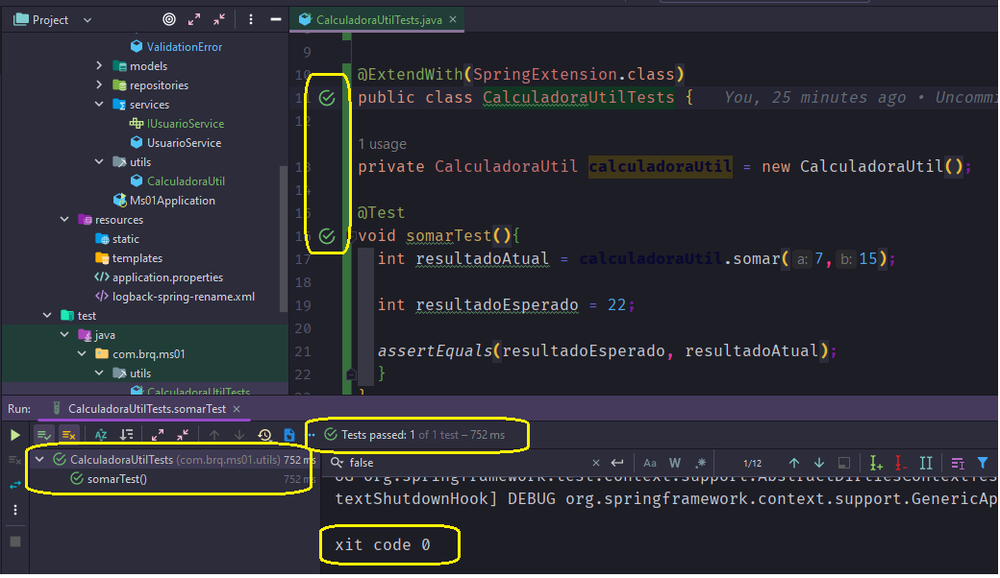
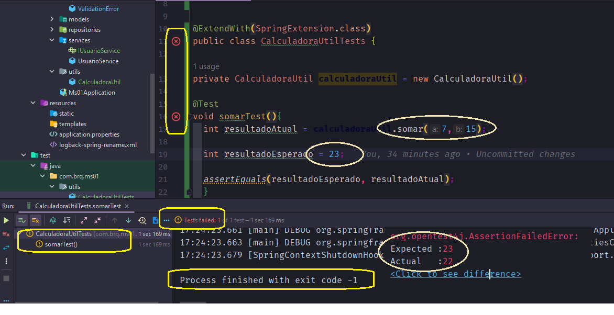

<h2 align = "center" >Aula 27  - Testes Unitários - 31/10/2022 - Segunda - Feira<h2>

<h3 align = "center" ><a href="https://github.com/ffborelli/curso-brq-java-2022-09-05/">Professor: Fabrizio Borelli</a></h3>

# Teste Unitário

O teste de software é a investigação do software a fim de fornecer informações sobre sua qualidade em relação ao contexto em que ele deve operar.

O principal objetivo dos testes é revelar falhas/bugs para que sejam corrigidas até que o produto final atinja a qualidade desejada/acordada.

O objetivo do teste unitário é testar cada método individualmente.
Para realizar o teste unitário: - Passamos um parametro de entrada; - Rodar o método; - Capturar a saída.
Do resultado da sáida temos: - O resultado esperado - Comparar a saída com o resultado esperado.
Faremos isso com a maioria dos métodos, só que de forma isolada, tendo em mente, que se testamos cada método individualmente, quando juntarmos todos os métodos, em teoria tudo deve funcionar.

Os testes unitários são realizados de forma automatizada, ou seja, os programadores vão criar o teste, que será executado sempre que for rodado na pipeline, ou seja, quando passar o código pela pipeline para chegar ao ambiente de HK, será rodado o teste unitário na pipeline, passando pelo teste unitário o programa segue, do contrário será rejeitado.

O Teste unitário pode ser reaproveitado, e no processo de execução do teste, podemos identificar irregularidades, fluxos não analisados, e assim temos a possibilidade de ajuste do código fonte.
<span style="font-family:nabla; font-size:1.3em;color: #A52A2A">Em um primeito momento, o tempo de desenvolvimento é **aumentado** mas, ao longo prazo temos ganho de **qualidade no código**.</span>

### Como testar um método que tem depêndencia de outro método.

### Conceito de Mokar

Simular algo, que se espera de outro método.
Podemos até maquiar erros, entretanto o objetivo é o de testar regras de negócio.
Assim, é importante fazermos os nossos mokes de acordo com os cenários propostos, por exemplo ter vários mokes para varios fluxos.

# Iniciando os testes Unitários

De Modo geral nos projetos, temos um pacote chamado utils (utilitário), onde vamos criar a classe CalculadoraUtil, e escrever a principio um metodo bem simples.

```
package com.brq.ms01.utils;

public class CalculadoraUtil {

public int somar (int a, int b) {

  return (a + b);
    }
}

```

Para realizar o teste unitário, vamos replicar o pacote com a classe no pacote Test, que vem por padrão com a aplicação.

**Na Classe Principal:**
- Usamos a anotação @**ExtendWith** passando como parametro a classe **(SpringExtension.class)**
- A dependencia **@ExtendWith ** é uma anotação para permitir a execução e registro de testes unitários. 
- **SpringExtension.class** permite a integração do Spring Boot com o Junit 5.
- O import: **import org.junit.jupiter.api.extension.ExtendWith;** , nos traz o framework junit, um dos principais frameworks de testes unitários para Java.

Note que no arquivo pom, temos de forma nativa a dependencia de teste para o Junit.

```
 <!-- dependência para criar os testes unitários do spring -->

        <dependency>
            <groupId>org.springframework.boot</groupId>
            <artifactId>spring-boot-starter-test</artifactId>
            <scope>test</scope>
        </dependency>

```



Note que precisamos realizar algumas alterações na classe de teste:
- alterar o sufixo do nome da classe de **CalculadoraUtil** para **CalculadoraUtilTests**.
- Adicionar a anotação **@Test**
- Adicionar a palavra Test como sufixo do nome do método.
- Não precisamos do modificador de acesso, apenas do retorno.

Para rodar o teste:
- Instanciar a classe principal que estamos testando.
- Chamamos a instancia dentro do metodo e passamos os numeros para realizar a soma.
- Criamos as variaveis para receber o valor atual e o valor esperado.
- Comparamos os valores, através do método nativo assertEquals();
- clique no play na lateral esqueda do código.

Teste Aprovado:



Teste Reprovado:




# Testar as camadas

As camadas service e controller, são as camadas mais usualmente testadas, porquê uma contém as regras de negocios e a outra a resposta para quem estiver chamando.
É Importante ressaltar que os testes são realizados nos médotos publicos, porque em teoria os métodos públicos, chamam os métodos privados.


