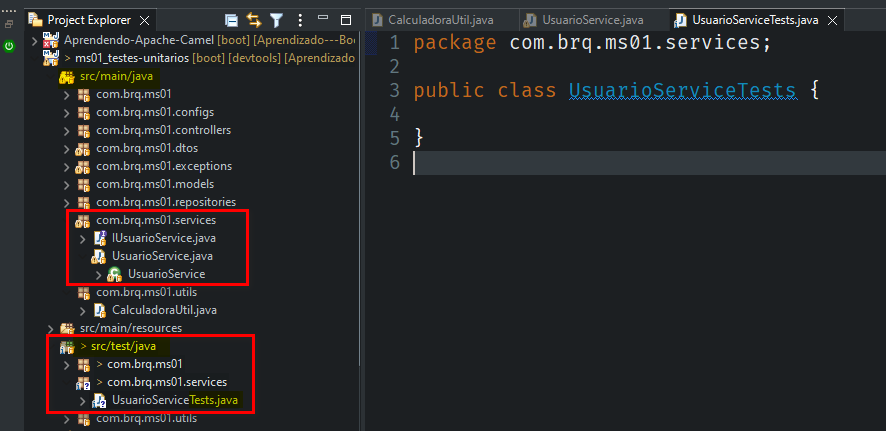

<h2 align = "center" >Aula 27  - Testes Unitários - 31/10/2022 - Segunda - Feira<h2>

<h3 align = "center" ><a href="https://github.com/ffborelli/curso-brq-java-2022-09-05/">Professor: Fabrizio Borelli</a></h3>

# Testes Unitários

**Objetivo:** testar/investigar individualmente nosso código-fonte, a fim de fornecer informações sobre sua qualidade em relação ao contexto em que ele deve operar.

O principal objetivo dos testes é revelar falhas/bugs para que sejam corrigidas até que o produto final atinja a qualidade desejada/acordada.

Para realizar o teste unitário: - Passamos um parametro de entrada; - Rodar o método; - Capturar a saída.
Do resultado da sáida temos: - O resultado esperado - Comparar a saída com o resultado esperado.
Faremos isso com a maioria dos métodos, só que de forma isolada, tendo em mente, que se testamos cada método individualmente, quando juntarmos todos os métodos, em teoria tudo deve funcionar.

Os testes unitários são realizados de forma automatizada, ou seja, os programadores vão criar o teste, que será executado sempre que for rodado na pipeline, ou seja, quando passar o código pela pipeline para chegar ao ambiente de HK, será rodado o teste unitário na pipeline, passando pelo teste unitário o programa segue, do contrário será rejeitado.

O Teste unitário pode ser reaproveitado, e no processo de execução do teste, podemos identificar irregularidades, fluxos não analisados, e assim temos a possibilidade de ajuste do código fonte.
<span style="font-family:nabla; font-size:1.3em;color: #A52A2A">Em um primeito momento, o tempo de desenvolvimento é **aumentado** mas, ao longo prazo temos ganho de **qualidade no código**.</span>

- **@SprintBootTest:** fornece um jeito de iniciar o Spring Boot para utilizar/realizar os testes unitários da classe
- **@ExtendWith:** uma anotação do JUnit (framework de teste) para rodar os testes unitários. No nosso caso utilizamos a classe SpringExtension para rodar os testes unitários seguindo uma extensão do spring boot

### Como testar um método que tem depêndencia de outro método.

### Conceito de Mokar

Simular algo, que se espera de outro método.
Podemos até maquiar erros, entretanto o objetivo é o de testar regras de negócio.
Assim, é importante fazermos os nossos mokes de acordo com os cenários propostos, por exemplo ter vários mokes para varios fluxos.

# Iniciando os testes Unitários

### Motivação
- **DADO QUE** (cenário inicial de teste : inicialização das variáveis)

- **QUANDO**( mockar: quando simulamos as outras camadas necessárias do teste)

- **ENTÃO** (execução do teste: chamar o método a ser testado)

- **VERIFICAR** (verificar o resultado do passo anterior)

De Modo geral nos projetos, temos um pacote chamado utils (utilitário), onde vamos criar a classe CalculadoraUtil, e escrever a principio um metodo bem simples.

```
package com.brq.ms01.utils;

public class CalculadoraUtil {

public int somar (int a, int b) {

  return (a + b);
    }
}

```

Para realizar o teste unitário, vamos replicar o pacote com a classe no pacote Test, que vem por padrão com a aplicação.

**Na Classe Principal:**
- Usamos a anotação @**ExtendWith** passando como parametro a classe **(SpringExtension.class)**
- A dependencia **@ExtendWith** é uma anotação para permitir a execução e registro de testes unitários. 
- **SpringExtension.class** permite a integração do Spring Boot com o Junit 5.
- O import: **import org.junit.jupiter.api.extension.ExtendWith;** , nos traz o framework junit, um dos principais frameworks de testes unitários para Java.

Note que no arquivo pom, temos de forma nativa a dependencia de teste para o Junit.

```
 <!-- dependência para criar os testes unitários do spring -->

        <dependency>
            <groupId>org.springframework.boot</groupId>
            <artifactId>spring-boot-starter-test</artifactId>
            <scope>test</scope>
        </dependency>

```


Note que precisamos realizar algumas alterações na classe de teste:
- alterar o sufixo do nome da classe de **CalculadoraUtil** para **CalculadoraUtilTests**.
- Adicionar a anotação **@Test**
- Adicionar a palavra Test como sufixo do nome do método.
- Não precisamos do modificador de acesso, apenas do retorno.

Para rodar o teste:
- Instanciar a classe principal que estamos testando.
- Chamamos a instancia dentro do metodo e passamos os numeros para realizar a soma.
- Criamos as variaveis para receber o valor atual e o valor esperado.
- Comparamos os valores, através do método nativo assertEquals();
- clique no play na lateral esqueda do código.

Teste Aprovado:


Teste Reprovado:


# Testar as camadas

As camadas **service** e **controller**, são as camadas mais usualmente testadas, porquê uma contém as regras de negocios e a outra a resposta para quem estiver chamando.
É Importante ressaltar que os testes são realizados nos médotos publicos, porque em teoria os métodos públicos, chamam os métodos privados.

### Camada Service
#### Método GetAll()

1. Replicar o pacote e a classe java no pacote de testes, adicionando Tests ao fim do nome da classe.


2. Testar o método publico 
  - Vamos analisar o que faz o métdo getAll():
    1. Acessa a camada repository(que é responsável por armazenar as regras de negócio da aplicação), encontra todos os registros e armazena em uma list de Model.
        ```
        // a repository vai executar : SELECT * FROM usuarios;
          List<UsuarioModel> list = usuRepository.findAll();

        ```
     2. Criamos uma lista vazia de DTOs, onde convertemos cada item da lista de Model para List DTO e armazenamos.

      ```
     // COMO CONVERTER UMA LISTA DE MODEL PARA LISTA DE DTO?

		  List<UsuarioDTO> listDTO = new ArrayList<>();

		  // Tipo da variável -
		  for (UsuarioModel balde : list) {
			
			listDTO.add( balde.toDTO() );
          
		  }

		  return listDTO;
			}

       ```


<span style="font-family:nabla; font-size:2em;color: #A52A2A">IMPORTÂNTE: </span> 
- Quando chamarmos o método publico getAll(), ele precisa de algum outro método para funcionar?
  - A Resposta é **SIM**, para que o método publico getAll() funcione, precisamos consultar a camada repository, consultar os todos os dados, armazenar na List e então consumir esses dados armazenados.
    - Nosso objetivo é testar o método publico getAll(), e não a repository, assim precisar MOKAR (simular), a camada de repository, para de fato conseguir realizar o teste isoladamente do método publico getAll(), esta é uma forma de isolamento, dado que quando os métodos auxiliares funcionam, o que queremos testar, também irá funcionar.
    - Basicamente, instanciamos o que queremos testar e mokamos o restante.


    ```
    @ExtendWith(SpringExtension.class)
    @SpringBootTest
    class UsuarioServiceTests {

	// Primeiro instanciamos a classe que desejamos testar

	@Autowired // Para injetetar a classe UsuarioService na classe UsuarioServiceTests
	private UsuarioService usuarioService;

	// MOKAR a camada repository

	@MockBean
	private UsuarioRepository usuarioRepository;

	@Test
	void getAllUsuariosTest() {

		// Instanciamos a List Mock da Repository
		List<UsuarioModel> listMock = new ArrayList<>();

		// Agora podemos usar a instancia da camada Model que é utilizada no mock da
		// repository
		UsuarioModel usuarioModel = new UsuarioModel();
		usuarioModel.setId(1);
		usuarioModel.setNome("Teste");
		usuarioModel.setTelefone("Meu telefone");

		// Vou pegar o objeto que foi mokado e add a list

		listMock.add(usuarioModel);

		/**
		 * Qdo(when) o metodo findAll() da camada repository,
		 * for acionado então(thenReturn) será retornado a listMock
		 **/

		when(usuarioRepository.findAll())
		.thenReturn(listMock);

		// Executar o método de desejo de teste

		List<UsuarioDTO> resultadoAtual = usuarioService.getAllUsuarios();

		/*E agora?
		 * Como eu posso afirmar que o teste estará correto?
		 * Primeiro: Qual o retorno da classe UsuarioService? Uma lista de DTO
		 * */
		//List<UsuarioDTO> resultadoEsperado = new ArrayList<>();


		 assertThat(resultadoAtual.get(0).getNome() )
         .isEqualTo("Teste");
		 assertThat(resultadoAtual.get(0).getTelefone())
         .isEqualTo("Meu telefone");
		 assertThat(resultadoAtual.get(0).getId())
         .isEqualTo(1);
	}

    ```
    

- Vamos realizar um teste dinamico.
  - Na classe UsuarioService, vamos implementar um novo método:

  ```
     
    public List<UsuarioDTO> getAllUsuarios2(){

        List<UsuarioModel> list = usuRepository.findAll();

        List<UsuarioDTO> listDTO = new ArrayList<>();

        for (UsuarioModel balde : list) {
            balde.setId( 2 * balde.getId() );
            balde.setNome( balde.getNome() + "JAVA" );
            listDTO.add( balde.toDTO() );
        }
        return listDTO;
    }

  ```

- Agora vamos testar esse novo método:

```
  @Test
	    void getAllUsuarios2Test(){

	        // o primeiro passo é simular (mockar) os objetos que preciso
	        List<UsuarioModel> listMock = new ArrayList<>();

	        String nome = "Teste";
	        int id = 1;

	        UsuarioModel usuarioModel = new UsuarioModel();
	        usuarioModel.setId(id);
	        usuarioModel.setNome(nome);
	        usuarioModel.setTelefone("Meu telefone");

	        listMock.add(usuarioModel);

	        // quando o metodo findAll() da camada repository for acionado, retorno a lista listMock
	        when ( usuarioRepository.findAll() )
	                .thenReturn( listMock );

	        // executar o método de desejo de teste
	        List<UsuarioDTO> resultadoAtual = usuarioService.getAllUsuarios2();

	        assertThat(resultadoAtual.get(0).getNome() )
	                .isEqualTo(nome + "JAVA");
	        assertThat(resultadoAtual.get(0).getTelefone())
	                .isEqualTo(usuarioModel.getTelefone());
	        assertThat(resultadoAtual.get(0).getId())
	                .isEqualTo(id * 2);

	    }

```
 

### Camada Service
#### Método create()

 $\textcolor{red}{\text IMPORTANTE: }$ Para testar métodos que possuam **try - catch**, precisamos realizar dois testes:
 1. Para caso positivo;

 ```
 @Test
	 	void createWhenSucess() {
	 		
	 		String email= "email";
	 		String nome = "nome";
	 		
	 		//Usuário para mokar a repository
	 		UsuarioDTO dto = new UsuarioDTO();
	 		dto.setEmail(email);
	 		dto.setNome(nome);
	 		
	 		UsuarioModel model = dto.toModel();
	 		model.setId(1);
	 		
	 		when(usuarioRepository.save(dto.toModel()))
	 		.thenReturn(model);
	 		
	 		//CHAMAR O MÉTODO A SER TESTADO
	 		
	 		UsuarioDTO salvoDTO = usuarioService.create(dto);
	 		
	 		//VERIFICAR SE ESTÁ CORRETO
	 		
	 		assertThat(salvoDTO.getNome()).isEqualTo(nome);
	 		assertThat(salvoDTO.getEmail()).isEqualTo(email);
	 		assertThat(salvoDTO.getId()).isPositive();
	 		
	 	}
		

```

2. Para caso negativo;

Abaixo notamos que o teste falhou, devido a uma questão de lógica do método testado.

- O famoso **NULLPOIIIINTERRRREXCEPPTIIIONN**(NullPointException), quando tentamos executar um método de uma variável nula, acontece a exceção NullPointException, que no caso, não estava sendo tratada no catch, com  **return usuarioSalvo.toDTO();**
- Note que estamos passando o usuário como null, e não alteramos a variavel no decorrer do método.
**UsuarioModel usuarioSalvo = null;**

```
@Test
	void createWhenFail() {
	 		
	//MOKAR O USO DO SAVE
	 		
	when(usuarioRepository.save(null)).thenThrow(Exception.class);
	 		
	//TESTAR O METODO EM QUESTÃO
	 		
	assertThrows(Exception.class, ()-> usuarioService.create(null));

	 	}

```
- Ao substituir o tipo de trativa da exceção, então temos que alterar o tipo de retorno no teste.

```
	@Test
	 	void createWhenFail() {
	 		
	 		//MOKAR O USO DO SAVE
	 		
	 		when(usuarioRepository.save(null)).thenThrow(new DataIntegrityViolationException(""));
	 		
	 		//TESTAR O METODO EM QUESTÃO
	 		
	 		assertThrows(NullPointerException.class, ()-> usuarioService.create(null));
	 		
	 		
	 	}

```
## Melhore sua cobertura de código

### Problema
Dificuldades para obter uma boa cobertura de código com Jacoco. O Lombok foi usado extensivamente no projeto e cada vez que adicionávamos um novo objeto de domínio perdíamos aquelas preciosas porcentagens de cobertura de código.
<span style="font-family: Anonymous Pro; font-size:1.5em;color: #DA70D6">Então o que estava acontecendo?</span>
Estávamos usando **@lombok.Data** para gerar métodos **equals / hashCode / toString** para Java beans. O problema era que a ferramenta de cobertura de código estava marcando esses métodos como descobertos. Portanto, em vez de ter um Java bean simples com cobertura total de código, acabamos com cerca de **15%** de cobertura por Java bean. Adicionando novos beans, apenas tornou a situação já ruim ainda pior.

## Solução
 A solução que finalmente escolhemos foi realmente muito simples.
 Na versão 0.8.0 , Jacoco adicionou suporte para filtrar todos os métodos anotados **@lombok.Generated** em seus relatórios. A única coisa que precisávamos fazer era dizer ao Lombok para adicionar a **@lombok.Generated** anotação aos seus métodos gerados.

Para corrigir o problema, adicionamos lombok.config o arquivo à raiz do nosso projeto. O arquivo tinha o seguinte conteúdo:
```
config.stopBubbling = true
lombok.addLombokGeneratedAnnotation = true
```
- **config.stopBubbling = true** está dizendo ao Lombok que este é o diretório raiz e que ele não deve procurar nos diretórios pai por mais arquivos de configuração (você pode ter mais de um arquivo de configuração do Lombok em diferentes diretórios/pacotes).

- **lombok.addLombokGeneratedAnnotation = true** está dizendo ao Lombok para adicionar @lombok.Generated anotações a todos os métodos gerados.

E é isso. Depois de aplicar as alterações fornecidas, Jacoco estava filtrando os métodos gerados automaticamente pelo Lombok, a cobertura do código voltou ao normal e todos ficaram felizes novamente :)
